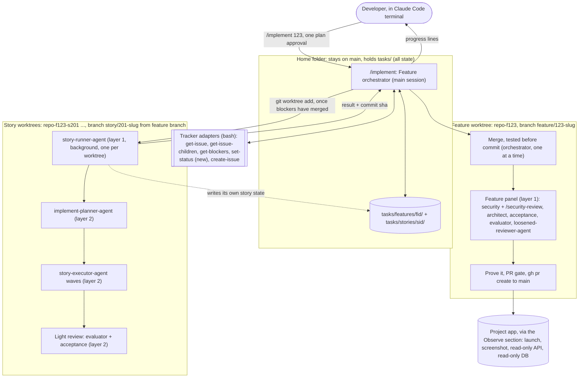
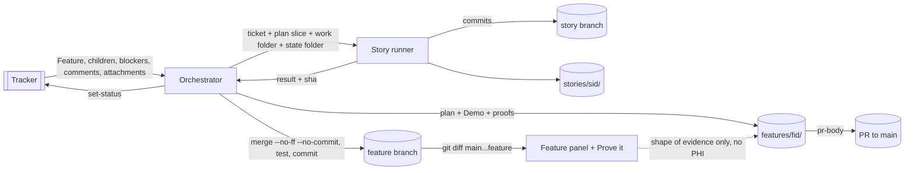

# ARCHITECTURE.md — Feature build in `/implement` ("a Feature is one unit of work")

**Version:** 1.0
**Date:** 2026-10-05
**Author:** Anudeep Sharma
**Status:** Draft. Regulated data is in scope (Prove it reads KBA data) and no compliance owner is named yet; see §6.
**Requirements:** [`grill-summary.md`](grill-summary.md) (14 decisions, 2026-09-30), from [`feature-unit-grill-brief.md`](feature-unit-grill-brief.md)
**Platform:** local only. The harness runs in a Claude Code terminal on the developer's machine. The only outside systems are the trackers and each project's own app. The eight sections are adapted to that: cost means tokens and agent runs, scale means how many stories run at once, and recovery means resume and crashes.

---

## 1. High-level component diagram



**Folder layout (all siblings, never nested):**

```
claude-code-harness\            home folder, stays on main, holds tasks\ (all state)
claude-code-harness-f123\       Feature worktree, branch feature/123-slug
claude-code-harness-f123-s201\  Story 201 worktree, branch story/201-slug
claude-code-harness-f123-s202\  Story 202 worktree, branch story/202-slug
```

| Component | Owns | Never does |
|---|---|---|
| **Orchestrator** (main session, home folder) | Reads the Feature and its dependency graph. Creates the Feature worktree and the story worktrees. Decides which stories are ready and caps how many run at once. Merges stories one at a time and tests each merge before committing it. Runs the Feature panel, Prove it, the PR gate and the PR. Owns the one human stop (plan approval). Writes `tasks/features/<fid>/` and prints progress lines | Edits story code |
| **Feature worktree** | The Feature branch, kept out of the home folder so home stays on main ([git-worktrees.md](rules/git-worktrees.md)) | none |
| **`story-runner-agent`** (new, background, one per story) | Works only in its own worktree. Runs the per-story pipeline: plan, executor waves, light review. Commits on its story branch. Writes only `tasks/stories/<sid>/` | Merges, pushes, opens a PR, or touches another worktree |
| **Planner / executors / light reviewers** (existing agents) | Unchanged roles. They now receive a **work folder** and a **state folder** instead of a single `YOUR_PROJECT_ROOT` | none |
| **Feature panel** | The whole-branch review on `git diff main...feature/<fid>` | Edits the tree while it reads (Hydra rule: commit first, change nothing during the reviews) |

**How deep agents go:** main → story runner → executor is 2 layers below the main session. Claude Code allows 3.

**Merges are a bottleneck on purpose.** Only the orchestrator writes the Feature branch, so there are no merge races, and the test after each merge always runs on a known state. Parallel stories queue at the merge, which takes seconds; the test-after-merge takes minutes.

**Overlapping stories.** Stories with a `/plan-features` overlap link (same file or module) never run in parallel. The second one starts after the first has merged, from a branch that already has the first story's changes. A conflict that happens anyway is resolved at merge time. If it can't be resolved cleanly, the story is stuck (§8).

---

## 2. Service / platform selection rationale

| # | Component | Choice | Why this over alternatives |
|---|---|---|---|
| 1 | Story isolation | **Git worktrees as sibling folders**, one per story and one for the Feature | Separate folders and branches mean no shared files or build scratch, and per-story commits and review. Rejected: *one folder with a file-overlap check across stories*, because build scratch still collides and commits and reviews get mixed; *full clones*, because they use more disk and need push/fetch between them |
| 2 | Worktree creation | **The orchestrator runs `git worktree add <path> -b story/<sid>-slug feature/<fid>-slug`** | Can start from the Feature branch after dependencies merge. Rejected: *the agent's built-in `isolation: "worktree"`*, which only starts from the default branch or HEAD (Claude Code docs, worktrees) |
| 3 | Story worker | **New named agent `story-runner-agent`**, with the Agent tool | A named agent is a quality contract ([autonomous-mode.md](rules/autonomous-mode.md)), so a `general-purpose` stand-in isn't allowed, and the runner needs the Agent tool to start planner, executors and reviewers. Rejected: *headless `claude -p` per worktree*, because `.claude/` is gitignored so a worktree has no skills, agents or hooks, and nothing watches them |
| 4 | Paths | **Every agent gets a work folder (the worktree) and a state folder (home `tasks/`)**, replacing the single `YOUR_PROJECT_ROOT` | Fixes [story-executor-agent.md:331](agents/story-executor-agent.md) ("may NOT access files outside `YOUR_PROJECT_ROOT`") and the mix of anchored and bare `tasks/` paths in [implement/SKILL.md](skills/implement/SKILL.md) and [run-tasks/SKILL.md](skills/run-tasks/SKILL.md). **This is the riskiest edit in the work**: these agents run on every build, standalone ones included |
| 5 | Story → Feature merge | **`git merge --no-ff --no-commit`, then tests, then commit or `git merge --abort`** | Keeps per-story commits and gives one merge commit per story, and the Feature branch only ever holds merges that passed. Rejected: *squash*, because it loses the per-story history; *commit then revert on failure*, because merging a reverted branch again in git silently drops its changes |
| 6 | Verify lock | **One per worktree**, at `tasks/stories/<sid>/.verify.lock`. Setting `verify-lock: global` in lessons/notes for stacks whose worktrees share a port, database or global cache | Worktrees don't share build scratch, so stories build in parallel and waves inside a story still queue. Rejected: *today's one lock per repo*, which queues every story behind every other |
| 7 | State format | **Plain `key: value` markdown files, plus single-line progress lines** | Same format as `executor-state.md` and `phase.md` today. Rejected: *JSON*, which would be inconsistent with every existing state file |
| 8 | Tracker access | **Bash adapters, plus the new `set-status.sh` in all four** (ADO, GitHub, Todoist, local) | Existing pattern, works on every tracker |
| 9 | Built-in `/security-review` | **Run from the security reviewer agent, working inside the Feature worktree** | It reviews "the current branch", and the main session's folder is home, on main. **Proven (F6 spike, 2026-10-06, Claude Code 2.1.289):** a subagent cannot type a slash command, so it runs `claude -p "/security-review"` as its own headless session with the Feature worktree as the current folder; that reviewed the worktree's branch against `origin/HEAD` and reported the vulnerability planted there. It needs `claude` on the PATH and an `origin/HEAD`. When either is missing, the agent runs the same checklist on `git diff main...feature/<fid>` and reports the built-in as unavailable, never quietly skipped |

**Cloud platform:** none (local only).

---

## 3. Cost-at-scale estimates

The cost is **tokens and agent runs**, not money. These are **estimates**; the harness doesn't measure tokens today (§7 fixes that). Assumptions: 5 stories, about 6 tasks per story in 3 waves, normal retries.

### Steady state (one 5-story Feature)

| Part | Agent runs | Tokens (rough) |
|---|---|---|
| Per story: runner 1, planner 1, executors about 6, light review 2, retries about 2 | about 12 | about 1.0–1.2M |
| × 5 stories | about 60 | about 5–6M |
| Feature panel: 5 reviewers, dead code split, one round of re-review after fixes | about 8 | about 0.8M |
| Orchestrator (including a compaction or two) | 1 | about 0.3M |
| **Total** | **about 70** | **about 6–7M** (mostly input, much of it cached) |

### Burst scenario

| Trigger | Impact | Delta | Mitigation |
|---|---|---|---|
| One story hits 3 attempts plus `/debug`, two review rounds with real findings | about 2× | about 12–14M tokens, about 100 agent runs | the 3-attempt rule caps retries; a stuck story is held, not retried forever |
| Stories in parallel | **same total, faster rate**: about 5× tokens per minute at 5 stories | reaches the plan's usage window or rate limits sooner | the story cap (§5); `run-paused reason="usage limit"` and resume (§8) |

### Unit economics

| Metric | Value |
|---|---|
| Per story | about 1.1M tokens, about 12 agent runs |
| Fixed per Feature (panel + orchestrator) | about 1.1M tokens |
| Today's equivalent (each story through `/implement` with the full 4-reviewer panel) | about 1.5M per story |
| Break-even | **Feature mode is cheaper from 2 stories up**, and it also catches cross-story defects |
| 1-story Feature or standalone item | about the same as today (one story plus one panel) |

---

## 4. Data architecture

### Storage

Everything is in the home folder's `tasks/` (gitignored), reached by absolute path, **never inside a worktree**.

| Location | Writer | What lives here | Retention |
|---|---|---|---|
| `tasks/features/<fid>/feature-state.md` | orchestrator only | run mode, plan approved yes/no, Feature branch and worktree, story cap, current phase. Per story: status (`pending` / `running` / `in-review` / `merged` / `stuck`), worktree, branch, commit sha, merge sha, attempts. **The source of truth for resume**, saved after every step | kept after merge |
| `tasks/features/<fid>/plan.md` | orchestrator | story order, parallel groups, Demo, proof and observation per criterion | kept |
| `tasks/features/<fid>/phase.md` | orchestrator | Feature-level marker | kept |
| `tasks/features/<fid>/progress.log` | orchestrator | progress lines, appended (§7) | kept |
| `tasks/features/<fid>/review/*.md`, `prove-it.md`, `pr-body.md`, `decisions-log.md` | orchestrator | panel reports, proof results, PR body, decisions combined from the stories at PR time | kept |
| `tasks/stories/<sid>/` (existing) | that story's runner only | brief, plan, test-strategy, `executor-state.md` (+ `feature: <fid>`), `phase.md`, `.tree-baseline`, `.verify.lock`, evaluation, acceptance, **its own `decisions-log.md`** | kept |
| Story worktrees and branches | orchestrator | the story's code | **removed after merge** (`git worktree remove`, `git branch -d`; never forced) |

**One writer per file**, so nothing needs locking. That's why the decisions log is per story and combined at PR time. [autonomous-mode.md](rules/autonomous-mode.md) currently has everyone append to one file, which with parallel writers would lose lines. That rule changes for Feature runs.

**`phase.md`** gets two optional keys, `feature:` and `story:`. The contract already says unknown keys are ignored, so `schemaVersion` stays 1.

### Data flow



### Regulated data paths

Prove it reads the real system through the read-only APIs and database, which on KBA projects can hold **PHI and PII**.

1. **The Observe section declares an environment**, local or test only. Prod is refused unless the project's rules explicitly allow it.
2. **Prove it records the shape of evidence only**: row counts, ids, field names, status codes, pass/fail. Never raw row contents or response bodies.
3. **Screenshots stay local** in `tasks/features/<fid>/review/`. The PR says what was seen and where the screenshot is, and never attaches it.
4. The security reviewer's "no sensitive data in logs" check covers `progress.log`, `prove-it.md` and `pr-body.md`, and `bin/pr-gate.js` refuses a PR while either of the last two holds a raw value (it names the line and the kind, never the value).

### Partitioning

Not applicable. There are no databases; state is per Feature and per story folder.

---

## 5. Scalability model

### More stories at once

| | 1 at a time | 3 at once | **5 at once (default)** |
|---|---|---|---|
| Agents at once | about 7 | about 19 | about 16 when waves are at most 2 wide; **31 at a wave width of 5, over the limit of 20** |
| Disk (worktrees with dependencies, about 1–3 GB each) | 1 extra | 3–4 | 5–6, **up to about 18 GB** |
| Setup (restore per worktree) | 1 | 3 | 5, minutes each |
| Machine load | fine | builds and tests run side by side | **the first bottleneck**: tests time out from load, not code ([tasks/notes.md](tasks/notes.md)) |
| Usage window | fine | about 3× rate | about 5× rate; may hit limits partway through a Feature |

**Rules:**
- `max-parallel-stories` defaults to **5** and can be set in lessons/notes.
- **The agent limit lowers it, never raises it.** Before starting a story, the orchestrator checks `1 + Σ (1 + widest remaining wave)` across running stories ≤ 20. If adding the next story would go over, it waits and starts that story as soon as one finishes. Approved plans are never re-split.
- The Feature panel runs only after every story has merged, so it never overlaps with the stories.

**Bottleneck order:** machine load, then the usage window, then the 20-agent limit.

### Bigger Features

| | 5 stories | 15 stories | 40 stories |
|---|---|---|---|
| Orchestrator context | fine | compacts, recovered from `feature-state.md` | resume becomes the normal path |
| Feature panel diff | fine | large | **too big to review properly** |
| Plan approval | one screen | long | rubber stamp |

**Limit: 8 stories per Feature, each 1, 2 or 3 points (5 only with a written reason).** `/plan-features` splits anything bigger into two Features, each with its own Demo, so a Feature fits in one sprint. `/implement` warns at plan approval but doesn't refuse.

---

## 6. Security architecture

Claude Code behaviour this section relies on (Claude Code docs, sub-agents and hooks):
- **Background agents' permission prompts pop up in the main session**, so an unapproved command stops the whole run.
- **`PreToolUse`/`PostToolUse` hooks run for every agent's tool calls**, so the existing `safety-check.js` protects story runners and executors.
- **Agents can't raise their own permissions.**

### What agents are allowed to run

| Layer | Mechanism | Details |
|---|---|---|
| Allowed commands | **A narrow allowlist, set up before the run** | `git worktree add/remove`, `git merge --no-ff`, `git merge --abort`, `git branch -d`, the build and test commands from lessons/notes, `trackers/active/*.sh`, `gh pr create`, the Observe commands. **Never a blanket "allow all Bash"** |
| Startup check | Plan commands compared with the allowlist | anything missing is listed **before** the run starts, so you approve once at the start |
| Always blocked (`safety-check.js`) | Hook on every agent's tool call | force-push, forced worktree removal, force-deleting a branch, hard resets, and any push to main. The only push is the Feature branch |

### Data classification

| Classification | Examples | Where it may go | Access control |
|---|---|---|---|
| Regulated (PHI/PII) | rows and responses read by Prove it on KBA projects | only in the moment; only its shape is recorded (§4) | read-only credential, test environment only |
| Internal | code, plans, reviews, decisions log | `tasks/` (local, gitignored), PR body | developer |
| Secret | credentials | environment variables or the OS secret store only | developer |

### Secret handling

| Secret | Storage | Rule |
|---|---|---|
| Tracker (`az login`, `gh auth`, Todoist token) | the tool's own login | existing `auth-check.sh`; expired means stop at startup |
| Read-only API / DB for Observe | environment variables or the OS secret store | the Observe section names the variable, never the value. "Read-only" is enforced by the credential (a read-only database user), never just by an instruction to the agent |
| Any credential | never in `tasks/` files, `progress.log`, the PR body or an agent prompt | the security reviewer checks those files |

**Compliance Owner sign-off** (required, because Prove it touches PHI/PII on KBA projects). There is no `tasks/compliance-owners.md` in this project (solo pack); create one from `templates/tasks/compliance-owners.md`. This document stays **Draft** until both are signed:
- Privacy Officer: (unassigned) Date: (pending)
- Security Lead: (unassigned) Date: (pending)

---

## 7. Observability plan

### Progress lines

A fixed single line, printed in the terminal and appended to `tasks/features/<fid>/progress.log`:

```
[harness] ts=2026-10-05T14:02:11Z feature=123 story=201 event=story-started phase=coding detail="wave 1/3"
```

| Event | When |
|---|---|
| `run-started` / `run-paused` / `run-finished` | start, any stop, end |
| `phase` | every Feature-level phase change: planning, coding, reviewing, proving, shipping |
| `story-started` / `story-merged` / `story-stuck` | each story's lifecycle |
| `merge-tested` | each test-after-merge, with pass/fail |
| `review-done` | each panel reviewer, with its finding count |
| `proof` | each criterion: met / not met / needs-person |
| `pr-opened` | with the PR number |

The same safety rules as `phase.md` `detail` ([phase-markers.md](rules/phase-markers.md)): one line, no control characters, a 200-character limit, no PHI or secrets.

### Markers and hang detection

- `phase.md` per Feature and per story, overwritten each step, shows the current state.
- **Hung story:** the orchestrator only wakes when an agent finishes. Each time it wakes, it checks every running story's `phase.md`. Not updated in **30 minutes** (the existing freshness rule) means `story-stuck reason="no progress 30m"`, and you're told.

### Run report

Written at the end and included in the PR:
- per story: time taken, attempts, findings;
- **measured agent count and tokens**. Every agent result already returns its tokens, tool calls and duration, so the orchestrator adds up its story runners' totals and each runner adds up its own children's. This replaces the estimates in §3;
- decisions made on your behalf, and anything that needs a person.

### Alerts

There's no dashboard. An alert is the run stopping and saying why: a stuck or hung story, three failed attempts, a missing tool or permission at startup, the usage limit, a red test after a merge.

### Tracing

Not applicable beyond the progress lines. Each line carries `feature=` and `story=`, which is enough to follow one story through a run.

---

## 8. Disaster recovery

| Metric | Target | Current | Gap |
|---|---|---|---|
| **Point lost (RPO)** | at most the wave in flight; state saved after every step | met (F1): a step record after every step, re-read first after a compaction | none |
| **Time to recover (RTO)** | minutes: `/implement --resume <fid>`, merged stories never redone | met (F1, F4): `--resume` for a story and for a Feature; `/run-tasks` retired (F7) | none |

### Failure scenarios and recovery

| Scenario | Detection | Recovery | Tested? |
|---|---|---|---|
| Main session compacts | the conversation starts with a summary | re-read `feature-state.md` before anything else, print the current phase again, carry on | yes: `feature-mode.probe.test.js`, and lived through in every Feature's build |
| Terminal closed, laptop asleep, session crash (background agents stop with it) | the developer runs `/implement --resume <fid>` | merged stories: skipped. Running stories: worktree checked, runner restarted from its last saved wave. Half-done merge: `git merge --abort`, then redone | yes: `feature-state.test.js` (resume), `worktree.test.js` (half-done merge) |
| Story runner crashes or hangs | an error result, or no progress for 30 minutes | worktree kept; one automatic restart from saved state; a second failure means stuck | yes: `feature-state.test.js` (hung, stuck), F5 Demo |
| Merge conflict that can't be resolved cleanly | the merge fails | `git merge --abort`, Feature branch untouched, story stuck, worktree kept | yes: `worktree.test.js` |
| Tests fail after a merge | red tests on the uncommitted merge | `git merge --abort`, story stuck with the test output | yes: `worktree.test.js` |
| Usage limit reached | agents return limit errors | `run-paused reason="usage limit"`, resume once the limit resets | no |
| Tracker unreachable | an adapter error | at startup: stop. During the run: log it and carry on | partly: a failed status write is a `tracker-error` line (F2) |
| Not enough disk | startup check: free space vs. stories × estimated size | stop at startup with the number needed | yes: `disk-check.test.js` |
| Branch moves in a worktree | branch check before and after every wave and every merge, in each worktree | stop; never decided automatically | yes: `worktree.test.js` (check-branch, merge) |

**Stuck-story rule (from the grill, Q11):** a stuck story and its dependents are held at `needs-person`. Independent stories finish and merge. The run pauses before the Feature-level phases, and there is no PR while a story is stuck.

The four probes this section once asked for (resume after compaction, resume after a crash, a merge
conflict, a failing test after a merge) were built in F4; the table above names where each lives.

---

## Appendix: Decision log

| Decision | Rationale | ADR |
|---|---|---|
| One build skill: `/implement` builds Features; `/story` retired | one build engine; keeps test-first, autonomous, rework and their probes | [ADR-0001](docs/adr/0001-one-build-skill.md) |
| Story isolation through sibling git worktrees, created by the orchestrator from the Feature branch | parallel stories without shared files; the built-in agent worktree option can't start from a named branch | [ADR-0002](docs/adr/0002-story-worktrees.md) |
| Orchestrator is the only merger; merges tested before commit (`--no-commit`, then abort or commit) | no merge races; the Feature branch only holds merges that passed; avoids reverting a merge in git | [ADR-0003](docs/adr/0003-orchestrator-only-merger.md) |
| Work folder and state folder split for every agent | the only way agents can work in a worktree; changes the prompts every build uses | [ADR-0004](docs/adr/0004-work-folder-state-folder.md) |
| One writer per state file; decisions log per story, combined at PR time | parallel stories without locking or lost lines | in this document |
| Per-worktree verify lock, with a global setting | parallel builds where safe | in this document |
| `max-parallel-stories` 5, lowered by the 20-agent limit; soft limit of 8 stories per Feature | machine load and reviewer depth are the real limits | in this document |
| Prove it records the shape of evidence only; Observe test environment only | PHI/PII on KBA projects | in this document |
| Allowlist checked before the run instead of auto or bypass-permissions mode | background-agent prompts would stall the run; runs read PHI | in this document |

## Appendix: Known issues found while writing this

- ~~**`safety-check.js` checks the text of every file written, not just commands.**~~ Fixed in #23: the destructive-command rules apply to Bash only, and the installed global copy now matches the repo. A Write is still checked for hardcoded secrets.
- **`drift-check.js` reads Mermaid diagram labels as component names** and reports them as drift against `todo.md`. Harmless, but noisy on every architecture edit.

## Appendix: What building it taught us

Each Feature (F1–F7) was built and then demoed on a throwaway project with real agents. What those
runs showed that the design did not foresee, and what changed because of it:

- **A subagent cannot wait for agents it starts in the background.** A story runner started its
  reviewers with `run_in_background`, ended its turn "waiting", and reported nothing; their results
  went to the main session. Runners now start every agent in the foreground, several in one message
  when they should run side by side (F5).
- **Paths relative to the current folder break inside a worktree.** `observe-check.js`'s default path
  pointed at a `tasks/` only the home folder has; runners pass the state folder's file explicitly (F5).
- **The built-in `/security-review` can review a Feature branch** when run as `claude -p` from the
  Feature worktree (§2 #9, F6). A subagent cannot type a slash command, so this is the only way in.
- **Agent definitions load when a session starts.** An agent added mid-session is "not found" until a
  restart, and a startup check that only looks for the file cannot see that. It only bites while the
  harness itself is being changed; an install is always followed by a new session (F6).
- **Removal must go through git.** The safety hook blocks recursive deletes, so Prove it's scratch
  copy is a detached `git worktree`, removed by `git worktree remove` only once clean — which doubles
  as the check that every broken line was put back (F6).
- **Nothing was lost retiring `/story` and `/run-tasks`** — but three small things had drifted into
  `/story` only (reading `lessons.md`, the default-branch push guard, the no-PII line for the decisions
  log). The inventory caught them; they now apply in both packs (F7,
  [docs/story-retirement-inventory.md](docs/story-retirement-inventory.md)).
