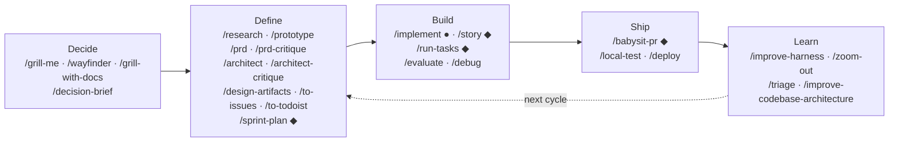
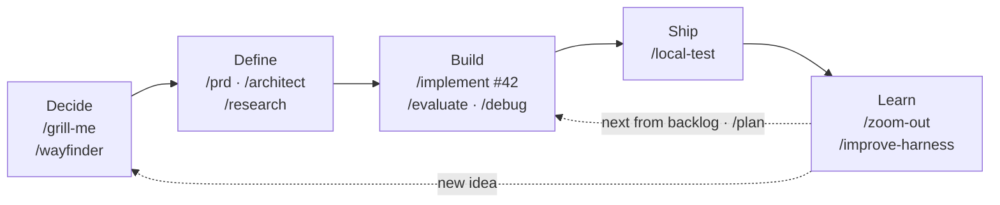
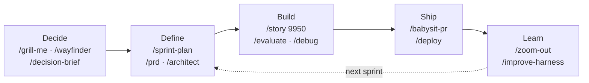

# claude-code-harness

[](LICENSE)
[](CHANGELOG.md)
[](https://nodejs.org)
[](https://github.com/anudeeps28/claude-code-harness/actions/workflows/ci.yml)
[](package.json)
[](hooks/__tests__)

**Claude Code writes the code. This harness manages everything else — stories, plans, reviews, and the paper trail your team needs to trust it.**

34 skills, 19 agents, 7 cross-platform Node hooks, 11 rules (5 path-scoped), tracker integration (ADO + GitHub + Todoist + Local). Install once, ship faster.

See [CHANGELOG.md](CHANGELOG.md) for what's in v2.0.0.


---

## Why this exists

AI coding tools are powerful — but unstructured. You start a task, the model edits 12 files, and you're not sure what happened or why. There's no plan to review, no evaluation to catch mistakes, and no way to know if the change actually matches what was asked for.

**This harness adds the structure.** Every feature runs through human gates — understand, plan, execute, evaluate, PR — and nothing advances without your explicit "go". Not an autonomous agent. A supervised one. (An optional `--autonomous` flag moves the gate to the PR instead of removing it — see [Autonomous mode](#autonomous-mode---autonomous) below.)

**If you're on a team**, it goes further. Context switching costs you 20 minutes every session re-reading the story, the architecture doc, and the last PR. Code review bots leave 15 threads and you fix them one at a time, push, wait, repeat. Sprint status lives in your head. And management doesn't trust AI-generated code because nobody can prove a human approved the plan before code was written. The harness handles all of that — tracker integration, PR review loops, sprint files, and the audit trail your team needs.

---

## What it does

### Solo developers
```
/implement #42                    ← reads issue, plans, builds, evaluates, PRs
/implement "add dark mode"        ← no issue needed, just a description
/implement #42 --discuss          ← 3 clarifying questions before planning
/implement #42 --research         ← scan codebase for reusable utilities first
/implement #42 --full             ← --discuss + --research (max understanding)
/implement #42 --auto             ← run all waves without pausing between them
/implement #42 --full --quick     ← max understanding, skip post-build evaluation
/implement #42 --autonomous       ← full pipeline, zero STOPs, opens a PR as the only gate
/implement --rework 58 "also rename the flag"   ← re-enter a rejected PR, fix on the same branch, push
/plan                             ← prioritize your open issues
```

**`/implement` flags** (composable):
- `--discuss` — pre-plan Q&A (intent, acceptance bar, constraints, free-form notes)
- `--research` — codebase scan produces a reuse inventory before the plan
- `--quick` — skip Phase 3 (evaluation + acceptance testing)
- `--auto` — auto-run all waves without pausing between them (still stops on failure)
- `--full` — sugar for `--discuss --research`; orthogonal to `--quick` and `--auto`
- `--autonomous` — run the entire flow with no human STOP checkpoints; self-answer reversible decisions, pause only when genuinely blocked, auto-push and open a non-draft PR as the single human gate. Implies `--auto` (NOT `--quick`).
- `--rework <PR#>` — mode selector (not additive): re-enter an already-open, rejected PR, merge its review comments with optional typed feedback, fix on the same branch, and push so the PR updates. Its own explicit autonomous entry point.

### Enterprise teams
```
/story 9950                 ← 8-phase story lifecycle with human gates
/story 9950 --auto          ← same, but auto-run waves (pause only on failure)
/story 9950 --autonomous    ← same 8-phase flow, zero STOPs, PR is the only gate
/sprint-plan 8              ← reads tracker, creates sprint file, surfaces gaps
/babysit-pr 163             ← loops PR reviews until zero threads remain
```

### Both get
```
/evaluate                   ← adversarial quality check before PR
/debug                      ← root cause diagnosis after 3 failed attempts
/troubleshoot               ← deep behavioral bug investigation
/local-test                 ← stack-agnostic build + test runner at 3 levels
```

---

## SDLC lifecycle at a glance

The harness covers the full software development lifecycle. Both solo and enterprise workflows share the same five phases — the difference is which skills you reach for in each one.



> ● = solo only &nbsp;&nbsp; ◆ = enterprise only &nbsp;&nbsp; unmarked = both

> **`/plan` ● is not a linear stage.** It reads your *existing* tracker backlog and prioritizes it — so it runs *after* `/to-issues` / `/to-todoist` have created tasks, never before. Think of it as the recurring "what's next?" step at the top of each cycle, feeding straight into `/implement`.

> **Charting a big effort (`/wayfinder`) — grill-me on steroids.** When a direction is too big to settle in one `/grill-me` sitting — many open decisions, not one — start with **`/wayfinder`**. It charts a **map** on your tracker (one map item + child **decision tickets**: research / prototype / grilling / task) and resolves **one ticket per session** until every decision is made, ending in a **spec** (the destination artifact). It *plans, it never builds*. From there rejoin the normal flow: **`/architect`** formalizes the spec → **`/to-issues`** / **`/to-todoist`** creates the build tasks → **`/implement`** / **`/story`** builds them. (Already sitting on a backlog? **`/plan`** prioritizes your existing issues and picks the next one to **`/implement`** — it reads tasks that already exist, so it comes *after* decomposition, never before.)

#### Solo developer path



#### Enterprise team path



### When to use what

| I want to... | Use this |
|---|---|
| Stress-test an idea, plan, or design | `/grill-me` |
| Stress-test a plan against your domain glossary and ADRs | `/grill-with-docs` |
| Chart a big, fuzzy effort — too many decisions to settle in one `/grill-me` | `/wayfinder` |
| Kill a bad feature before spending a sprint | `/decision-brief` |
| Cache research on an external API or integration | `/research` |
| Test a UI or architecture approach before committing | `/prototype` |
| Write a PRD | `/prd` |
| Critique a PRD for gaps, bad metrics, missing rollback | `/prd-critique` |
| Design the system architecture | `/architect` |
| Critique an architecture doc for gaps and risks | `/architect-critique` |
| Generate the full spec stack (DB schema, API ref, diagrams) | `/design-artifacts` |
| Break a PRD into executable vertical-slice tickets | `/to-issues` |
| Break a PRD into Todoist milestones and tasks | `/to-todoist` |
| Build a feature test-first with strict RED-GREEN-REFACTOR | `/tdd` |
| Build a feature from an issue | `/story` or `/implement` |
| Adversarially evaluate code before opening a PR | `/evaluate` |
| Debug a hard or recurring bug | `/debug` (or `/diagnose`) |
| Investigate a behavioral bug (wrong output, wrong logic) | `/troubleshoot` |
| Drive a PR to zero review threads | `/babysit-pr` |
| Deploy and verify (branch-test or post-merge) | `/deploy` |
| Run build + tests at 3 levels | `/local-test` |
| Plan a sprint from the tracker | `/sprint-plan` |
| Ask about sprint status, blockers, or todos | `/pa` |
| Get a high-level map of unfamiliar code | `/zoom-out` |
| Find shallow modules and propose deepening refactors | `/improve-codebase-architecture` |
| Route and categorize an incoming issue | `/triage` |
| Run a weekly self-improvement loop on the harness | `/improve-harness` |

---

## Where does your task list live?

The harness supports three **modes** for tracking work. You pick one at install time.

| Mode | Where tasks live | Local task files |
|---|---|---|
| **Local** | Markdown files in the repo (`tasks/issues/`) | They ARE the tracker |
| **Tracker** | External tracker (GitHub Issues, ADO, Todoist) | None — only story folders |
| **Both** | External tracker (canonical) + a local `todo.md` mirror | Auto-generated mirror only |

**The philosophy:** local task files are shared memory between you and the agent on this machine — per-developer, gitignored, never committed to git. They are not team documents. In **both** mode, the tracker is the boss; `todo.md` is a regenerable printout of it.

This is separate from the **execution workspace** (`tasks/stories/<id>/`), which always exists in every mode. Story folders hold the brief, plan, executor state, and review files that agents pass between phases — they are working memory for the current story, not the task registry.

### Local mode basics

- **One file per task** in `tasks/issues/` — e.g. `tasks/issues/42.md`
- **Sequential integer IDs** — IDs are bare numbers (`42`), never reused. The next ID is the highest existing + 1.
- **Hand-editing a task's body is fine** — the body (below the YAML frontmatter) is where task-specific notes live
- **`todo.md` is the self-updating dashboard** — auto-generated, never edit it by hand. It regenerates whenever tasks change.
- **`notes.md` is your scratchpad** — session narrative, ad-hoc notes, and conventions go here
- **PRs reference tasks** with `Task: 42` trailer lines (the story-pr-agent writes them for you). In tracker/both modes, native closing keywords (`Closes #N`, `Fixes AB#N`) are used instead.

---

## Quick start

```bash
git clone https://github.com/anudeeps28/claude-code-harness
node claude-code-harness/install/install.js        # Windows, macOS, Linux
# or, on Unix if you prefer Bash:
bash claude-code-harness/install/install.sh
```

**The clone you just made is disposable** — the installer copies the harness into your project's
`.claude/` and records how to fetch updates later. You can delete `claude-code-harness/` afterward;
`/update-harness` re-fetches the source on demand (no persistent clone is kept anywhere). See
[Updating the harness](#updating-the-harness).

The installer asks:
1. **Global or project?** — `~/.claude/` (all projects) or `.claude/` (one repo)
2. **Solo or Enterprise?** — Simpler issues workflow or full sprint ceremony
3. **Where should your task list live?** — Local files (`tasks/issues/`, no accounts needed), an external tracker as the single source of truth (GitHub or Todoist on solo; Azure DevOps, GitHub, or Todoist on enterprise), or both (external tracker plus a local `todo.md` mirror the harness keeps in sync)
4. **Where do your pull requests live?** — GitHub / GitHub Enterprise, Azure Repos, or none. Picks the code-platform adapter, independent of the tracker.
5. **Your details** — Name, org, project paths. Fills in all placeholders automatically.
6. **PRD output mode** — File only, tracker only, or both (with canonical source choice)
7. **CONTEXT.md + ADR** (project only) — Copies a domain glossary template and ADR convention to your project root.

Then:
- **Solo:** `/implement #42` or `/plan`
- **Enterprise:** `/story 9950` or `/sprint-plan 8`

**Non-interactive / scripted installs** — pass answers as flags so `--yes` needs no follow-up edits:

```bash
node claude-code-harness/install/install.js --yes --project /my/app \
  --name "Alex" --project-name "my-app"
```

`--help` lists every flag (`--pack`, `--tracker`, `--prd-mode`, ADO/Todoist/team fields, etc.). Any values you omit stay as placeholders, and the installer prints the exact command to fill them in later.

---

## Updating the harness

Updates are **fetch-on-demand** — there is no persistent clone to maintain. `/update-harness` reads
the `update` config in your `.harness-manifest.json`, fetches the harness source (a shallow clone to a
temp dir, discarded afterward), applies the changes, and cleans up.

```bash
/update-harness                  # interactive — checks, shows changelog, asks before applying
/update-harness --global         # target only the global install
/update-harness --project        # target only the project install
```

**Update channel** — how "latest" is resolved. Default is the newest `main`; you can pin a version or
point at a local clone:

| Channel | What it does | Set it with |
|---|---|---|
| `latest` *(default)* | Always the newest `main` on GitHub | `--latest` |
| `pinned` | Stays on a version tag until you bump it | `--pin <version>` |
| `local` | Updates from a local clone (harness development / offline) | `--local <path>` |

The channel flags work at **install time** and with **`--update`** to re-point an existing install:

```bash
/update-harness --pin 3.2.0      # pin this install to v3.2.0
/update-harness --latest         # go back to tracking the newest main
```

Headless (no Claude needed) — fetches on demand just like the skill:

```bash
node <harness-checkout>/install/install.js --check  --project /my/app   # read-only version check
node <harness-checkout>/install/install.js --update --project /my/app   # apply updates
# --source <dir> reuses an already-fetched checkout instead of fetching again
```

Updates are safe:
- A **snapshot** is saved to `~/.claude/.harness-backups/` before any mutation (last 3 kept)
- **settings.json** is surgically reconciled — your permissions, env vars, MCP config, and custom hooks are preserved byte-for-byte
- **Orphaned files** (removed from the harness source) are cleaned up automatically
- **Rollback** in one command: `cp -r "<snapshot-path>/"* "<target>/"`

Installs created before the `update` block gains it automatically on the first update (the old
`answers.harnessRepoPath` clone pointer is dropped). Installs created before v2.1 also run a one-time
backfill to create `.harness-manifest.json`.

---

## Prerequisites

- [Claude Code](https://claude.ai/code) installed
- `jq` — required for every install ([download](https://jqlang.github.io/jq/download/)); the tracker adapters depend on it
- **For ADO:** `az` CLI + `az extension add --name azure-devops`
- **For GitHub:** `gh` CLI + `gh auth login`
- **For Todoist:** `td` CLI on your `$PATH` (or point `$TODOIST_CLI` at the binary)
- **For local tracker:** no external CLI needed

---

## Skills

Skills are invoked with `/skill-name` in Claude Code. Each skill is a folder under `skills/` with a `SKILL.md` file and optional supporting files (templates, scripts, reference docs).

### Solo workflow (2 skills)
| Skill | Usage | What it does |
|---|---|---|
| **implement** | `/implement #42` or `/implement "add dark mode"` | Build a feature from issue or description — plan, execute, evaluate, PR |
| **plan** | `/plan` | Read open issues, prioritize, create a simple work plan |

### Enterprise workflow (2 skills)

These are the only skills the solo pack does **not** install — they drive the sprint/story lifecycle and spawn enterprise-only agents.

| Skill | Usage | What it does |
|---|---|---|
| **story** | `/story <ID>` | 8-phase story lifecycle: understand → define goal → plan → execute → local verify → review → e2e gate → PR |
| **sprint-plan** | `/sprint-plan <N>` | Sprint planning — reads tracker, writes sprint file, surfaces gaps |

### Shared skills (both packs)
| Skill | Usage | What it does |
|---|---|---|
| **run-tasks** | `/run-tasks <ID>` | Resume task execution from a story plan — the resume path for both `/implement` and `/story` |
| **babysit-pr** | `/babysit-pr <PR>` | Drive a PR to zero review threads |
| **evaluate** | `/evaluate` | Adversarial quality check before PR |
| **debug** | `/debug` (alias: `/diagnose`) | Feedback-loop-first diagnosis — builds a deterministic pass/fail signal, then tests ranked falsifiable hypotheses one at a time |
| **troubleshoot** | `/troubleshoot` | Deep behavioral bug investigation (up to 5 iterations) |
| **deploy** | `/deploy` | Deploy and verify (branch-test or post-merge modes) |
| **local-test** | `/local-test [1\|2\|3]` | Build, test, and Docker integration at 3 levels |
| **prd** | `/prd` | Generate a Product Requirements Document |
| **pa** | `/pa <question>` | Personal assistant — answers from task files, keeps them in sync |
| **sync-tasks** | `/sync-tasks` | Report drift across task files and project artifacts (PRD, architecture, ADRs). Auto-suggested when `drift-check` hook hard-blocks |
| **improve-harness** | `/improve-harness [days]` | Self-improvement loop — finds recurring friction in recent sessions/evaluations and proposes harness edits. Never auto-applies |
| **grill-me** | `/grill-me <plan or design>` | Decision-tree interrogation of a plan, design, or proposal — serial questions with recommendations until shared understanding is reached |
| **wayfinder** | `/wayfinder <loose idea>` or `/wayfinder <map ID>` | Plan an effort too big for one session as a map of decision tickets on the tracker — chart once, then resolve one ticket per session until the way is clear. Works on all four trackers |
| **decision-brief** | `/decision-brief` | Pre-PRD assumption pass — 4 inline phases produce a Decision Brief with tiered evidence thresholds and a risk-ranked test plan |
| **prd-critique** | `/prd-critique <path> [--brief <path>]` | Run 6 critique checks on a PRD — metric validity, NFR specificity, failure modes, assumption traceability, rollback plan, intent clarity. Read-only |
| **to-issues** | `/to-issues <prd>` | Decompose a PRD into vertical-slice tracker issues — each slice is end-to-end demoable with Given/When/Then acceptance criteria |
| **to-todoist** | `/to-todoist --project "X" --section "Y"` | Decompose planning artifacts into Todoist milestones and tasks — milestones as uncompletable parents, tasks as prioritized subtasks. Full tracker adapter integration (session routing, `/plan`, `/implement`) |
| **grill-with-docs** | `/grill-with-docs <plan or design>` | Like /grill-me but anchored in CONTEXT.md and ADRs — challenges vague terms against the glossary, surfaces plan-vs-decision contradictions, updates CONTEXT.md with resolved terms |
| **research** | `/research <topic> [--urls ...]` | Research an external API, integration, or library — caches provenance-tagged findings in research.md for downstream agents to read |
| **architect** | `/architect <path-to-PRD>` | Design system architecture from a PRD — interactive 8-section ARCHITECTURE.md with Mermaid diagrams, cost model, and compliance gates |
| **architect-critique** | `/architect-critique <path> [--prd <path>]` | Run 5 critique axes on an architecture doc — NFR fit, failure modes, cost stress-test, security posture, operability. Read-only |
| **prototype** | `/prototype <feature or question>` | Throwaway prototyping — creates 1-3 candidate approaches in `_prototype/`, compares trade-offs in decision.md, cleans up losers after user picks |
| **zoom-out** | `/zoom-out [file or module]` | High-level map of unfamiliar code — callers, dependencies, patterns, architecture context. Conversational, no file artifact |
| **improve-codebase-architecture** | `/improve-codebase-architecture [area]` | Find shallow modules, apply the deletion test, propose deepening refactors. Updates CONTEXT.md, proposes ADRs for rejected ideas |
| **triage** | `/triage <issue-id>` | Route incoming issues through a 5-state workflow with bug/enhancement categorization, reproduction attempts, and tracker label management |
| **design-artifacts** | `/design-artifacts [all \| doc-name ...]` | Generate the project-level spec stack from ARCHITECTURE.md + PRD — database schema, API reference, sequence diagrams, data flow, deployment, dev guide, debugging guide |
| **tdd** | `/tdd <feature or behavior>` | Strict RED-GREEN-REFACTOR cycles with vertical slicing — one behavior at a time, test first, no refactoring while RED |
| **calibrate** | `/calibrate` | Learning effectiveness dashboard — shows how learnings are performing, promotes high-scoring ones to permanent rules, archives ineffective ones |
| **sync-tracker** | `/sync-tracker [--dry-run]` | Reconcile merged PRs and completed work against open tracker items — closes delivered issues/tasks in GitHub, Todoist, or ADO |
| **update-harness** | `/update-harness [--global\|--project]` | Check for and apply updates to your claude-code-harness installation — resolves target, shows changelog, applies updates with human confirmation |

---

## How `/implement` works (Solo)

```
Phase 1: UNDERSTAND
  → Spawns story-understand-agent (same agent as /story)
  → Reads issue from tracker + codebase + project docs
  → Produces 8-point pre-planning brief
  → Writes handoff contract: tasks/stories/<id>/brief.md
  → STOP 1: "Does this brief match your understanding?"

Phase 1.5: GOAL DEFINITION
  → Defines e2e modality, acceptance criteria, concrete gate
  → STOP 1.5: "Approve this goal, or adjust it?"

Phase 1c: PLAN
  → Spawns implement-planner-agent with brief + goal as input
  → Produces XML task plan + test strategy
  → STOP: "Review the plan and test strategy. Say 'go' to start building."

Phase 2: EXECUTE (wave by wave)
  → Same executor agent and worktree isolation as /story
  → Every <verify> runs build + relevant tests — task only ✅ when tests pass
  → After each wave — "Continue?" (unlabeled checkpoint — the skill has no STOP 2)
  → 3-attempt rule: 3 failures → auto-invokes /debug

Phase 2.5: LOCAL VERIFICATION
  → Runs /local-test to verify full build + tests pass (stack-agnostic)

Phase 3: EVALUATE + ACCEPT + PR (combined)
  → All four review agents run in parallel: evaluator, acceptance-test-agent, architect-reviewer-agent, security-reviewer-agent
  → Evaluator checks code quality, test coverage, plan compliance
  → Acceptance tester verifies the feature works as intended; architect reviewer checks architecture drift + NFRs; security reviewer checks OWASP Top 10, PHI/PII, auth, deps
  → Drafts commit messages + PR description
  → STOP 3: "Review and commit. Say 'push' when ready."
```

**Key difference from `/story`:** Same understand phase and quality, but lighter ceremony — no sprint file dependency, no child task structure. Optional `--discuss` and `--research` flags for extra depth.

---

## How `/story` works (Enterprise)

```
Phase 1: UNDERSTAND
  → Reads issue from tracker + codebase
  → Produces 8-point brief
  → Writes handoff contract: tasks/stories/<id>/brief.md
  → STOP 1: "Does this match your understanding?"

Phase 1.5: GOAL DEFINITION
  → Defines the e2e modality, machine-oracle check, acceptance-criteria-as-gate, and observability plan
  → STOP 1.5: "Approve this goal, or adjust it?"

Phase 2: PLAN
  → Decomposes into XML task plan with parallel groups
  → Produces test strategy — acceptance criteria, integration scenarios, regression guardrails
  → Mandatory type="test" tasks in every plan
  → Writes handoff contracts: plan.md + test-strategy.md
  → STOP 2: "Approve the plan and test strategy?"

Phase 3: EXECUTE (wave by wave)
  → Groups tasks into waves by parallel_group
  → Launches each task in an isolated git worktree (auto-cleaned)
  → Every <verify> runs build + relevant tests — task only ✅ when tests pass
  → Updates handoff contract: tasks/stories/<id>/executor-state.md
  → STOP 3: After every wave — "Continue?"
  → 3-attempt rule: 3 failures → auto-invokes /debug

Phase 3.5: LOCAL VERIFICATION
  → Runs /local-test to verify full build + all tests pass (stack-agnostic, reads lessons.md)

Phase 3.6: EVALUATION + ACCEPTANCE + ARCHITECTURE + SECURITY REVIEW (parallel)
  → Spawns 4 agents in parallel, each with fresh adversarial context
  → Evaluator: build, tests, plan compliance, test coverage, code quality
  → Acceptance tester: verifies acceptance criteria, integration points, regression guardrails
  → Architect reviewer: architecture drift, NFR compliance, data-flow integrity
  → Security reviewer: OWASP Top 10, PHI/PII detection, auth patterns, dependency vulns
  → Writes handoff contracts: evaluation.md + acceptance.md + architecture-review.md + security-review.md
  → STOP 3.6: Review findings from all four — "fix" or "skip" each

Phase 3.7: e2e GOAL GATE (goal-seeking)
  → Runs the Phase 1.5 e2e gate — the terminal check that the goal is actually met end-to-end
  → Automated modality: /local-test e2e. No machine oracle: show actual behavior via the observability plan for human sign-off
  → Failed gate → evidence-driven re-approach (observe → compare → root-cause → fix → re-run), never a blind retry; 3 failed re-approaches → invoke /debug
  → Blocks PR until green (or human-accepted); skipped only via the Phase 1.5 "skip gate — no runtime impact" escape hatch

Phase 4: COMMIT + PR
  → Drafts atomic commit messages
  → Writes PR description
  → STOP 4: You run the git commands
```

---

### Autonomous mode (`--autonomous`)

`--autonomous` is a per-run flag on both `/implement` and `/story` that runs the whole pipeline —
understand → plan → build → test → review → PR — with **no human STOP checkpoints**. It implies
`--auto`, but it does NOT imply `--quick`: evaluation, acceptance testing, and the e2e goal gate
still run. Autonomy is never a default — it only ever starts from an explicit per-run flag.

**Self-answer rule.** At every point that would normally STOP and wait for you: if the decision is
reversible AND there's a clear recommended option, the agent takes it and logs one line to
`tasks/stories/<id>/decisions-log.md`. Otherwise it pauses and asks.

**Pause-anyway triggers** — the agent stops and asks regardless of the self-answer rule: a
contradiction it can't reconcile, an irreversible action, a scope change, or the 3-failed-attempts
rule (routes to `/debug`). A task FAIL or BLOCKED also halts the run.

**The PR is the single human gate.** It's opened non-draft, and it carries a "Decisions made on your behalf" section rendering the decisions log verbatim — so you see every reversible call made without
you. There is no auto-merge: the PR always waits for your verdict — approve to merge, or request
changes and then re-enter the PR yourself with `/implement --rework <PR#>` (see the reject loop below).

**Two entry doors.** (1) A task already in the tracker → `/implement #42 --autonomous` (or
`/story 9950 --autonomous`) runs autonomously end to end. (2) A loose idea → define it interactively
first with `/wayfinder` or `/grill-me` (these stay a conversation, never autonomous), then hand the
resulting task to an autonomous run.

**Reject loop.** `/implement --rework <PR#> ["typed feedback"]` re-enters a rejected PR — it merges
the PR's review comments with any optional typed feedback into one fix list, fixes on the same
branch, and pushes so the PR updates in place.

**DevOS Bridge.** This is the harness half of DevOS's launch-and-watch pipeline; the DevOS Bridge
(separate repo) will later spawn each pipeline role as its own session using this same flag.

---

## Agents

| Agent | Model | Used by | Role |
|---|---|---|---|
| `implement-planner-agent` | opus | `/implement` Phase 1c | Plans tasks from brief + goal — one pass |
| `story-understand-agent` | opus | `/story` Phase 1, `/implement` Phase 1 | Reads issue + docs, produces 8-point brief |
| `story-plan-agent` | opus | `/story` Phase 2 | Produces XML task plan |
| `story-executor-agent` | sonnet | `/story`, `/implement` | Writes code for one task |
| `story-pr-agent` | sonnet | `/story` Phase 4 | Commit messages + PR description |
| `evaluator-agent` | opus | `/evaluate`, `/story` 3.6 | Adversarial quality check + test coverage (no security/arch overlap) |
| `acceptance-test-agent` | opus | `/story` 3.6, `/implement` 3 | Verifies acceptance criteria, integration, regression |
| `architect-reviewer-agent` | opus | `/story` 3.6, `/implement` 3 | Architecture drift, NFR compliance, data-flow integrity |
| `security-reviewer-agent` | opus | `/story` 3.6, `/implement` 3 | OWASP Top 10, PHI/PII detection, auth patterns, dependency vulns |
| `babysit-pr-analyst` | sonnet | `/babysit-pr` | Categorizes threads as fix/reply |
| `babysit-pr-fixer` | sonnet | `/babysit-pr` | Applies code fixes |
| `sprint-plan-tracker-reader` | haiku | `/sprint-plan` | Calls tracker CLI |
| `sprint-plan-docs-reader` | haiku | `/sprint-plan` | Reads docs/ folder |
| `sprint-plan-gap-analyzer` | opus | `/sprint-plan` | Produces planning questions |
| `debug-agent` | opus | `/debug` | Root cause diagnosis |
| `troubleshoot-investigator` | opus | `/troubleshoot` | Behavioral bug investigation |
| `chief-operator` | opus | standalone (`--agent`) | Main-session project operator — researches, decides, delegates via handoff files + tracker tasks. Never implements. |
| `builder` | opus (1M) | role session (`--agent`) | The build session of the two-session pipeline — understand → plan → code → test → fix, then commit/push and draft the PR body |
| `reviewer` | opus (1M) | role session (`--agent`) | The fresh adversarial review session — report-only, BLOCK vs ADVISORY verdict to the story files, never edits code |

**Model routing:** Opus for thinking/judging, Sonnet for writing code, Haiku for simple data gathering.
The two **role identities** (`builder`, `reviewer`) are not sub-agents — they are whole sessions an
external orchestrator spawns, declared in the role roster below.

### Role roster

`.claude/harness-roles.json` (schemaVersion 2) declares the per-work-item pipeline as **two sessions**:

| Role | Runs | Model / effort | Produces |
|---|---|---|---|
| `builder` | `/implement` (solo) or `/story` (enterprise), `/run-tasks` | opus 1M / medium | plan, code + tests, pushed branch, drafted PR body |
| `reviewer` | `/evaluate` | opus 1M / high | evaluation, acceptance, architecture and security reports — never code |

Each role also carries a `phases[]` list — **display metadata only** (planning → Navigator, coding →
Shipwright, testing → Lookout, reviewing → Warden, shipping → Harbormaster). Renaming a persona is a
roster data edit, not a code change. The skills announce the current phase by writing
`tasks/stories/<id>/phase.md` at every subagent boundary — see `rules/phase-markers.md`.

The roster is per-project data: a team on a tighter plan edits their own copy to declare smaller
models, with no code change anywhere.

---

## Hooks

All hooks run on Node.js (>= 20). One cross-platform implementation.

| Hook | Event | What it does |
|---|---|---|
| `safety-check.js` | PreToolUse (Bash\|Write) | Blocks destructive git/file/cloud operations + Write of hardcoded secrets |
| `catalog-trigger.js` | PostToolUse (Write/Edit) | Rebuilds SKILLS_CATALOG.md when skills change |
| `drift-check.js` | PostToolUse (Write/Edit) | Detects cross-file drift in task files and project artifacts (PRD, ARCHITECTURE.md, ADRs) — 11 invariants covering enum consistency, cross-references, NFR coverage, ADR contradictions, and more |
| `todo-render-trigger.js` | PostToolUse (Write/Edit) | Re-renders `tasks/todo.md` when a file under `tasks/issues/` is edited directly (local tracker mode only) |
| `pre-compact.js` | PreCompact | Saves in-progress state before context compression |
| `tracker-sync.js` | SessionStart + SessionEnd | Tracker sync sweep — on start, flags open items that look delivered; on end, closes items with explicit written evidence (merged PRs with closing keywords). Never auto-acts on ambiguous evidence |
| `session-log.js` | SessionEnd | Appends session metadata to sessions.jsonl |

---

## Rules

`rules/` holds 10 `.md` files. 5 are **path-scoped** — they carry `paths:` front-matter and activate only when Claude reads matching files:

| Rule | Applies to | Content |
|---|---|---|
| `code-style.md` | `src/**` | Code style — defers to `tasks/lessons.md` for stack-specific conventions |
| `testing.md` | `tests/**` | Unit, integration, and acceptance test rules |
| `test-philosophy.md` | `**/*` | Testing philosophy — 3 levels of testing, mandatory test strategy, verify commands must include tests |
| `security.md` | `**/*.{cs,ts,js,py}` | No hardcoded secrets, parameterized queries |
| `documentation.md` | `docs/**`, `*.md` | Don't modify architecture docs |

The other 5 are always-referenced convention docs, not path-scoped:

| Rule | Content |
|---|---|
| `autonomous-mode.md` | `--autonomous` self-answer rule, pause-anyway triggers, decisions log |
| `git-worktrees.md` | Worktree naming, lifecycle, and cleanup conventions |
| `next-task.md` | Live-check procedure for "what's next" questions across tracker + local sources |
| `phase-markers.md` | The `phase.md` marker contract written at every subagent boundary |
| `progress-tracking.md` | `TodoWrite` as the in-session mirror of the durable story plan |

---

## Tracker adapters

Skills don't know if you use ADO, GitHub, Todoist, or the local file tracker. The adapter layer abstracts it:

```
skill → trackers/active/get-issue.sh → ado/get-issue.sh  (or)  github/get-issue.sh
```

All four tracker adapters (ADO, GitHub, Todoist, local) implement the same 8-script interface:
- `get-issue.sh <ID>` — Returns work item details
- `get-issue-children.sh <ID>` — Returns child tasks
- `get-sprint-issues.sh <SPRINT_NUM>` — Returns all sprint issues
- `create-issue.sh "<title>" "<body>" "<label>"` — Creates a new issue or work item
- `add-label.sh <ID> "<label>"` — Adds a label/tag to an issue or work item
- `remove-label.sh <ID> "<label>"` — Removes a label/tag from an issue or work item
- `close-issue.sh <ID> ["<reason>"]` — Closes/completes an issue or work item
- `list-issues.sh` — Returns all open items as a JSON array

(The GitHub adapter is a superset — it ships 15 scripts, adding project/milestone/sub-issue helpers on top of the shared 8.)

To add a new tracker (Linear, Jira): implement these 8 scripts and drop them in `trackers/your-tracker/`.

### Code-platform adapters (PR review)

PR review thread operations live in a **separate** `code-platform/` layer, independent of the task tracker. Skills like `/babysit-pr` call `code-platform/active/<script>`. Each backend implements the same 3-script interface:
- `get-pr-review-threads.sh <PR_ID>` — Returns unresolved review threads
- `reply-pr-thread.sh <PR_ID> <THREAD_ID> "<text>"` — Posts a reply
- `resolve-pr-thread.sh <PR_ID> <THREAD_ID>` — Resolves a thread

Three backends ship: `github`, `azure-repos`, and `none` (fails loudly when no platform is configured).

---

## Handoff contracts

Each story gets structured state files that pass between phases:

```
tasks/stories/<story-id>/
├── brief.md           ← Phase 1 output (8-point understanding)
├── plan.md            ← Phase 2 output (XML task plan + rationale)
├── test-strategy.md   ← Phase 2 output (acceptance criteria + integration scenarios + regression guardrails)
├── executor-state.md  ← Phase 3 output (per-task results, updated per wave)
├── evaluation.md          ← Phase 3.6 output (evaluator findings + verdict)
├── acceptance.md          ← Phase 3.6 output (acceptance criteria PASS/FAIL + verdict)
├── architecture-review.md ← Phase 3.6 output (architecture drift + NFR compliance)
└── security-review.md     ← Phase 3.6 output (security findings + PHI/PII risks)
```

This prevents goal drift, makes debugging easier, and lets the evaluator check work against the original plan.

---

## Task files

The installer creates task files under `tasks/` based on your workflow pack. All task data is per-developer and gitignored — it is not committed to the repo.

### Solo pack
| File | What it holds |
|---|---|
| `todo.md` | Auto-generated task dashboard *(never hand-edit)* |
| `notes.md` | Code conventions, git rules, decisions, known fixes, scratchpad |
| `sessions.jsonl` | Append-only session log *(auto-generated)* |

### Enterprise pack
| File | What it holds |
|---|---|
| `todo.md` | Auto-generated task dashboard *(never hand-edit)* |
| `lessons.md` | Git rules, code conventions, known fixes, Code Rabbit patterns |
| `notes.md` | Session narrative, scratchpad |
| `pr-queue.md` | All branches, PR numbers, merge status |
| `flags-and-notes.md` | Blockers, decisions, open questions |
| `tracker-config.md` | Personal pointers: Todoist project, sprint naming, resource names |
| `people.md` | Team member roles + waiting-on *(optional)* |
| `sprint<N>.md` | Sprint master status table *(one per sprint)* |
| `sessions.jsonl` | Append-only session log *(auto-generated)* |

In **local mode**, task files also appear in `tasks/issues/` (one `.md` per task). See [Where does your task list live?](#where-does-your-task-list-live) above.

---

## Customization

### Works out of the box
`/implement`, `/plan`, `/story`, `/babysit-pr`, `/sprint-plan`, `/run-tasks`, `/debug`, `/troubleshoot`, `/evaluate`, `/prd`, `/prd-critique`, `/pa`

### Needs configuration
- **`/deploy`** — Fill in cloud resource names in `tasks/tracker-config.md` (enterprise) or `tasks/notes.md` (solo).
- **`/local-test`** — Fill in the "Test Commands" section of `tasks/lessons.md` with your stack's build/test/integration commands. The skill is stack-agnostic and reads commands from there.
- **`/prd` output mode** — The installer asks where PRDs should live (file, tracker, or both). To change later, edit `prd_mode` in `tasks/tracker-config.md` (enterprise) or `tasks/notes.md` (solo). Options: `file`, `tracker`, `both-file-canonical`, `both-tracker-canonical`.
- **`compliance-owners.md`** — If your project handles regulated data (PHI/PII/SOC 2), fill in `tasks/compliance-owners.md` with your org's Privacy Officer and Security Lead. Skills like `/decision-brief`, `/architect`, and `/architect-critique` use these names for sign-off fields and will warn if the file is missing.
- **Task files** — Add your project's code conventions, known fixes, and build commands.

### Stack-agnostic
The harness works with any tech stack. Agents read conventions from `tasks/lessons.md` — customize that file for your language (.NET, Node, Python, Go, etc.). The example `lessons.md` ships with .NET/C# conventions as a starting point.

---

## Repository structure

```
claude-code-harness/
├── skills/           ← 34 skills
├── agents/           ← 19 agents (16 sub-agents + 1 main-session operator + 2 role identities)
├── hooks/            ← 7 automated hooks
├── rules/            ← 11 rules (5 path-scoped)
├── trackers/         ← 4 tracker adapters: ado, github, todoist, local (8 scripts each; github is a 15-script superset)
├── code-platform/    ← 3 PR-review backends: github, azure-repos, none (3 scripts each)
├── templates/tasks/  ← blank task files for new projects
├── examples/         ← filled-in examples (GitHub + .NET)
├── install/          ← interactive installer
├── LICENSE           ← MIT
├── VERSION           ← current version number
├── CHANGELOG.md      ← release history
├── README.md         ← this file
├── CONFIGURE.md      ← manual configuration reference
└── CONTRIBUTING.md   ← how to add skills, agents, or trackers
```

---

## Key design decisions

- **Human gates everywhere** — Nothing advances without your explicit "go". Not an autonomous agent — a supervised one. The optional per-run `--autonomous` flag doesn't change that stance — it MOVES the single human gate to the PR (opened non-draft, never auto-merged), it never removes it.
- **3-attempt rule** — If something fails 3 times, stops retrying and invokes `/debug` for root-cause diagnosis. Prevents infinite loops.
- **Early-exit on high confidence** — Troubleshoot investigations can stop before 5 iterations when root cause is confirmed (>95% confidence, stress-tested).
- **File-based state** — `tasks/` files are the source of truth. No database, no external service. Git-friendly, diff-friendly, human-readable.
- **Adversarial evaluation** — The evaluator agent has a different prompt than the executor. It tries to break things, not defend them. Prevents self-evaluation bias.
- **Model routing** — Opus for thinking, Sonnet for typing, Haiku for data gathering. Saves cost without sacrificing quality.
- **Tracker abstraction** — Same 8-script interface across all 4 tracker adapters (ADO, GitHub, Todoist, local). A separate `code-platform/` layer (github, azure-repos, none) handles PR review threads with its own 3-script interface. Adding a new tracker = implementing 8 shell scripts.

---

## License

MIT — see [LICENSE](LICENSE).

---

## Contributing

See [CONTRIBUTING.md](CONTRIBUTING.md) for how to add skills, agents, hooks, or tracker adapters.

---

## Contact

Questions, feedback, or just want to chat about the harness? Find me on X: [@anudeep_2806](https://x.com/anudeep_2806).
