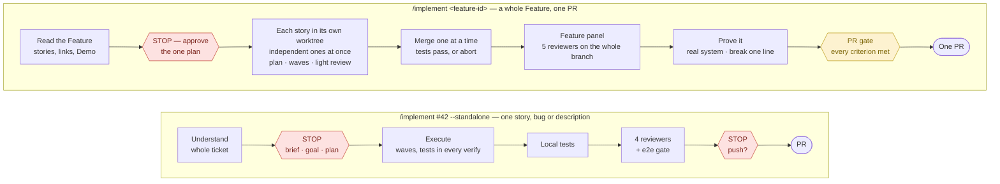
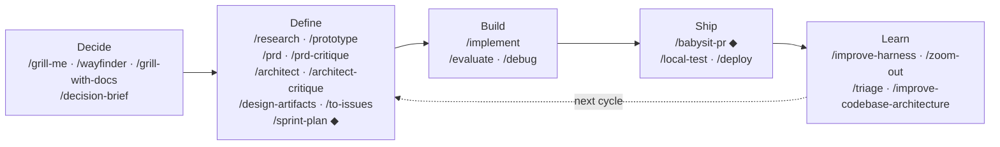
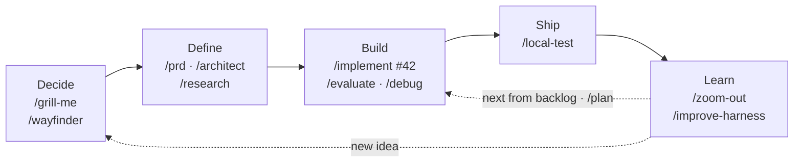
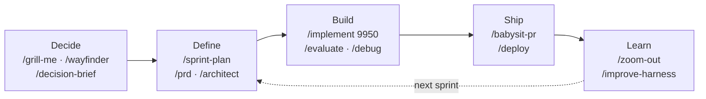

# claude-code-harness

[](LICENSE)
[](CHANGELOG.md)
[](https://nodejs.org)
[](https://github.com/anudeeps28/claude-code-harness/actions/workflows/ci.yml)
[](package.json)
[](hooks/__tests__)

**Claude Code writes the code. This harness manages everything else — stories, plans, reviews, and the paper trail your team needs to trust it.**

32 skills, 20 agents, 7 cross-platform Node hooks, 13 rules (5 path-scoped), tracker integration (ADO + GitHub + Todoist + Local). Install once, ship faster.

See [CHANGELOG.md](CHANGELOG.md) for what's in v2.0.0.


```mermaid
flowchart TB
    subgraph F["/implement &lt;feature-id&gt; — a whole Feature, one PR"]
        direction LR
        F1["Read the Feature<br/>stories, links, Demo"] --> F2{{"STOP — approve<br/>the one plan"}}
        F2 --> F3["Each story in its own worktree<br/>independent ones at once<br/>plan · waves · light review"]
        F3 --> F4["Merge one at a time<br/>tests pass, or abort"]
        F4 --> F5["Feature panel<br/>5 reviewers on the whole branch"]
        F5 --> F6["Prove it<br/>real system · break one line"]
        F6 --> F7{{"PR gate<br/>every criterion met"}}
        F7 --> F8(["One PR"])
    end

    subgraph S["/implement #42 --standalone — one story, bug or description"]
        direction LR
        S1["Understand<br/>whole ticket"] --> S2{{"STOP<br/>brief · goal · plan"}}
        S2 --> S3["Execute<br/>waves, tests in every verify"]
        S3 --> S4["Local tests"]
        S4 --> S5["4 reviewers<br/>+ e2e gate"]
        S5 --> S6{{"STOP<br/>push?"}}
        S6 --> S7(["PR"])
    end

    F ~~~ S

    classDef stop fill:#fde2e1,stroke:#c0392b,color:#7b241c
    classDef gate fill:#fdf2d0,stroke:#b7950b,color:#7d6608
    class F2,S2,S6 stop
    class F7 gate
```

Red boxes are where you decide (`--autonomous` answers the reversible ones itself and leaves the PR
as the only gate); the amber PR gate is automatic — no PR while a criterion is unmet. Every step is saved, so `/implement --resume <id>` carries on after a crash.

---

## Why this exists

AI coding tools are powerful — but unstructured. You start a task, the model edits 12 files, and you're not sure what happened or why. There's no plan to review, no evaluation to catch mistakes, and no way to know if the change actually matches what was asked for.

**This harness adds the structure.** Every feature runs through human gates — understand, plan, execute, evaluate, PR — and nothing advances without your explicit "go". Not an autonomous agent. A supervised one. (An optional `--autonomous` flag moves the gate to the PR instead of removing it — see [Autonomous mode](#autonomous-mode---autonomous) below.)

**If you're on a team**, it goes further. Context switching costs you 20 minutes every session re-reading the story, the architecture doc, and the last PR. Code review bots leave 15 threads and you fix them one at a time, push, wait, repeat. Sprint status lives in your head. And management doesn't trust AI-generated code because nobody can prove a human approved the plan before code was written. The harness handles all of that — tracker integration, PR review loops, sprint files, and the audit trail your team needs.

---

## What it does

### Build — one skill, both packs

`/implement` is the one build skill (ADR-0001). What it builds depends on what you hand it:

```
/implement 40                     ← a Feature: one plan for all its stories, each story built in its own
                                    git worktree (independent ones at the same time), one review panel
                                    and Prove it on the whole Feature, then one PR
/implement 42 --standalone        ← a single story or bug with no parent Feature
```

**Building a Feature.** `/to-issues` breaks the work into a Feature with stories and the links
between them. `/implement 40` shows you one plan — the stories in dependency order, the Feature's
Demo, and anything it needs from you — and that is the only stop. Then it builds every story, merges
each into the Feature branch only after its tests pass, runs the five-reviewer panel and **Prove it**
on the whole branch, and opens one PR — only when every acceptance criterion is met.

**Building a standalone item.** `/implement 42 --standalone` builds one story or bug on its own
branch: understand → goal → plan → build in waves → local tests → four reviewers → e2e gate → PR, with
a stop for you at each step (or none, with `--autonomous`). A story that belongs to a Feature makes
`/implement` ask whether you meant the Feature.

### Solo developers
```
/implement #42 --standalone       ← reads the issue, plans, builds, evaluates, PRs
/implement "add dark mode"        ← no issue needed, just a description
/implement #42 --discuss          ← 3 clarifying questions before planning
/implement #42 --research         ← scan codebase for reusable utilities first
/implement #42 --full             ← --discuss + --research (max understanding)
/implement #42 --auto             ← run all waves without pausing between them
/implement #42 --full --quick     ← max understanding, skip post-build evaluation
/implement #42 --autonomous       ← full pipeline, zero STOPs, opens a PR as the only gate
/implement --rework 58 "also rename the flag"   ← re-enter a rejected PR, fix on the same branch, push
/implement --resume 42            ← carry on a stopped run (a story or a whole Feature)
/plan                             ← prioritize your open issues
```

**`/implement` flags** (composable):
- `--discuss` — pre-plan Q&A (intent, acceptance bar, constraints, free-form notes)
- `--research` — codebase scan produces a reuse inventory before the plan
- `--quick` — skip Phase 3 (evaluation + acceptance testing)
- `--auto` — auto-run all waves without pausing between them (still stops on failure)
- `--full` — sugar for `--discuss --research`; orthogonal to `--quick` and `--auto`
- `--autonomous` — run the entire flow with no human STOP checkpoints; self-answer reversible decisions, pause only when genuinely blocked, auto-push and open a non-draft PR as the single human gate. Implies `--auto` (NOT `--quick`).
- `--rework <PR#>` — mode selector (not additive): re-enter an already-open, rejected PR, merge its review comments with optional typed feedback, fix on the same branch, and push so the PR updates. Its own explicit autonomous entry point.
- `--resume <id>` — carry on a stopped run from its saved state; a finished task or a merged story is never redone.
- `--standalone` — build a story or bug that has no parent Feature.
- `--tdd` — test-first: each slice is planned as empty shell → failing test → real code (always on for bug fixes).
- `--no-ship` — run everything up to the PR, then stop before any git step.

### Enterprise teams
```
/implement 9950             ← the same build; also keeps the sprint file's Master Status Table in step
/implement 9950 --autonomous ← zero STOPs, the PR is the only gate
/sprint-plan 8              ← reads tracker, creates sprint file, surfaces gaps
/babysit-pr 163             ← loops PR reviews until zero threads remain
```

### Both get
```
/evaluate                   ← adversarial quality check before PR
/debug                      ← root cause diagnosis after 3 failed attempts
/troubleshoot               ← deep behavioral bug investigation
/local-test                 ← stack-agnostic build + test runner at 3 levels
```

---

## SDLC lifecycle at a glance

The harness covers the full software development lifecycle. Both solo and enterprise workflows share the same five phases — the difference is which skills you reach for in each one.


```mermaid
flowchart LR
    P0["Decide<br/>/grill-me · /wayfinder · /grill-with-docs<br/>/decision-brief"]
    P1["Define<br/>/research · /prototype<br/>/prd · /prd-critique<br/>/architect · /architect-critique<br/>/design-artifacts · /to-issues<br/>/sprint-plan ◆"]
    P2["Build<br/>/implement<br/>/evaluate · /debug"]
    P3["Ship<br/>/babysit-pr ◆<br/>/local-test · /deploy"]
    P4["Learn<br/>/improve-harness · /zoom-out<br/>/triage · /improve-codebase-architecture"]

    P0 --> P1 --> P2 --> P3 --> P4
    P4 -.->|"next cycle"| P1
```

> ● = solo only &nbsp;&nbsp; ◆ = enterprise only &nbsp;&nbsp; unmarked = both

> **`/plan` ● is not a linear stage.** It reads your *existing* tracker backlog and prioritizes it — so it runs *after* `/to-issues` has created tasks, never before. Think of it as the recurring "what's next?" step at the top of each cycle, feeding straight into `/implement`.

> **Charting a big effort (`/wayfinder`) — grill-me on steroids.** When a direction is too big to settle in one `/grill-me` sitting — many open decisions, not one — start with **`/wayfinder`**. It charts a **map** on your tracker (one map item + child **decision tickets**: research / prototype / grilling / task) and resolves **one ticket per session** until every decision is made, ending in a **spec** (the destination artifact). It *plans, it never builds*. From there rejoin the normal flow: **`/architect`** formalizes the spec → **`/to-issues`** creates the build tasks → **`/implement`** builds them. (Already sitting on a backlog? **`/plan`** prioritizes your existing issues and picks the next one to **`/implement`** — it reads tasks that already exist, so it comes *after* decomposition, never before.)

#### Solo developer path


```mermaid
flowchart LR
    D["Decide<br/>/grill-me<br/>/wayfinder"]
    Def["Define<br/>/prd · /architect<br/>/research"]
    B["Build<br/>/implement #42<br/>/evaluate · /debug"]
    S["Ship<br/>/local-test"]
    L["Learn<br/>/zoom-out<br/>/improve-harness"]

    D --> Def --> B --> S --> L
    L -.->|"new idea"| D
    L -.->|"next from backlog · /plan"| B
```

#### Enterprise team path


```mermaid
flowchart LR
    D["Decide<br/>/grill-me · /wayfinder<br/>/decision-brief"]
    Def["Define<br/>/sprint-plan<br/>/prd · /architect"]
    B["Build<br/>/implement 9950<br/>/evaluate · /debug"]
    S["Ship<br/>/babysit-pr<br/>/deploy"]
    L["Learn<br/>/zoom-out<br/>/improve-harness"]

    D --> Def --> B --> S --> L
    L -.->|"next sprint"| Def
```

### When to use what

| I want to... | Use this |
|---|---|
| Stress-test an idea, plan, or design | `/grill-me` |
| Stress-test a plan against your domain glossary and ADRs | `/grill-with-docs` |
| Chart a big, fuzzy effort — too many decisions to settle in one `/grill-me` | `/wayfinder` |
| Kill a bad feature before spending a sprint | `/decision-brief` |
| Cache research on an external API or integration | `/research` |
| Test a UI or architecture approach before committing | `/prototype` |
| Write a PRD | `/prd` |
| Critique a PRD for gaps, bad metrics, missing rollback | `/prd-critique` |
| Design the system architecture | `/architect` |
| Critique an architecture doc for gaps and risks | `/architect-critique` |
| Generate the full spec stack (DB schema, API ref, diagrams) | `/design-artifacts` |
| Break a PRD into executable vertical-slice tickets | `/to-issues` |
| Build a feature test-first with strict RED-GREEN-REFACTOR | `/tdd` |
| Build a whole Feature, every story, to one PR | `/implement <feature-id>` |
| Build one story, bug or issue | `/implement #42 --standalone` |
| Build a whole story or issue test-first | `/implement #42 --tdd` |
| Carry on a run that stopped part-way | `/implement --resume <id>` |
| Get a queue of small fixes shipped before a demo | `/hackathon` |
| Adversarially evaluate code before opening a PR | `/evaluate` |
| Debug a hard or recurring bug | `/debug` (or `/diagnose`) |
| Investigate a behavioral bug (wrong output, wrong logic) | `/troubleshoot` |
| Drive a PR to zero review threads | `/babysit-pr` |
| Deploy and verify (branch-test or post-merge) | `/deploy` |
| Run build + tests at 3 levels | `/local-test` |
| Plan a sprint from the tracker | `/sprint-plan` |
| Ask about sprint status, blockers, or todos | `/pa` |
| Get a high-level map of unfamiliar code | `/zoom-out` |
| Find shallow modules and propose deepening refactors | `/improve-codebase-architecture` |
| Route and categorize an incoming issue | `/triage` |
| Run a weekly self-improvement loop on the harness | `/improve-harness` |

---

## Where does your task list live?

The harness supports three **modes** for tracking work. You pick one at install time.

| Mode | Where tasks live | Local task files |
|---|---|---|
| **Local** | Markdown files in the repo (`tasks/issues/`) | They ARE the tracker |
| **Tracker** | External tracker (GitHub Issues, ADO, Todoist) | None — only story folders |
| **Both** | External tracker (canonical) + a local `todo.md` mirror | Auto-generated mirror only |

**The philosophy:** local task files are shared memory between you and the agent on this machine — per-developer, gitignored, never committed to git. They are not team documents. In **both** mode, the tracker is the boss; `todo.md` is a regenerable printout of it.

This is separate from the **execution workspace** (`tasks/stories/<id>/`), which always exists in every mode. Story folders hold the brief, plan, executor state, and review files that agents pass between phases — they are working memory for the current story, not the task registry.

### Local mode basics

- **One file per task** in `tasks/issues/` — e.g. `tasks/issues/42.md`
- **Sequential integer IDs** — IDs are bare numbers (`42`), never reused. The next ID is the highest existing + 1.
- **Hand-editing a task's body is fine** — the body (below the YAML frontmatter) is where task-specific notes live
- **`todo.md` is the self-updating dashboard** — auto-generated, never edit it by hand. It regenerates whenever tasks change.
- **`notes.md` is your scratchpad** — session narrative, ad-hoc notes, and conventions go here
- **PRs reference tasks** with `Task: 42` trailer lines (the story-pr-agent writes them for you). In tracker/both modes, native closing keywords (`Closes #N`, `Fixes AB#N`) are used instead.

---

## Quick start

```bash
git clone https://github.com/anudeeps28/claude-code-harness
node claude-code-harness/install/install.js        # Windows, macOS, Linux
# or, on Unix if you prefer Bash:
bash claude-code-harness/install/install.sh
```

**The clone you just made is disposable** — the installer copies the harness into your project's
`.claude/` and records how to fetch updates later. You can delete `claude-code-harness/` afterward;
`/update-harness` re-fetches the source on demand (no persistent clone is kept anywhere). See
[Updating the harness](#updating-the-harness).

The installer asks:
1. **Global or project?** — `~/.claude/` (all projects) or `.claude/` (one repo)
2. **Solo or Enterprise?** — Simpler issues workflow or full sprint ceremony
3. **Where should your task list live?** — Local files (`tasks/issues/`, no accounts needed), an external tracker as the single source of truth (GitHub or Todoist on solo; Azure DevOps, GitHub, or Todoist on enterprise), or both (external tracker plus a local `todo.md` mirror the harness keeps in sync)
4. **Where do your pull requests live?** — GitHub / GitHub Enterprise, Azure Repos, or none. Picks the code-platform adapter, independent of the tracker.
5. **Your details** — Name, org, project paths. Fills in all placeholders automatically.
6. **PRD output mode** — File only, tracker only, or both (with canonical source choice)
7. **CONTEXT.md + ADR** (project only) — Copies a domain glossary template and ADR convention to your project root.

Then:
- **Solo:** `/implement #42` or `/plan`
- **Enterprise:** `/implement 9950` or `/sprint-plan 8`

**Non-interactive / scripted installs** — pass answers as flags so `--yes` needs no follow-up edits:

```bash
node claude-code-harness/install/install.js --yes --project /my/app \
  --name "Alex" --project-name "my-app"
```

`--help` lists every flag (`--pack`, `--tracker`, `--prd-mode`, ADO/Todoist/team fields, etc.). Any values you omit stay as placeholders, and the installer prints the exact command to fill them in later.

---

## Updating the harness

Updates are **fetch-on-demand** — there is no persistent clone to maintain. `/update-harness` reads
the `update` config in your `.harness-manifest.json`, fetches the harness source (a shallow clone to a
temp dir, discarded afterward), applies the changes, and cleans up.

```bash
/update-harness                  # interactive — checks, shows changelog, asks before applying
/update-harness --global         # target only the global install
/update-harness --project        # target only the project install
```

**Update channel** — how "latest" is resolved. Default is the newest `main`; you can pin a version or
point at a local clone:

| Channel | What it does | Set it with |
|---|---|---|
| `latest` *(default)* | Always the newest `main` on GitHub | `--latest` |
| `pinned` | Stays on a version tag until you bump it | `--pin <version>` |
| `local` | Updates from a local clone (harness development / offline) | `--local <path>` |

The channel flags work at **install time** and with **`--update`** to re-point an existing install:

```bash
/update-harness --pin 3.2.0      # pin this install to v3.2.0
/update-harness --latest         # go back to tracking the newest main
```

Headless (no Claude needed) — fetches on demand just like the skill:

```bash
node <harness-checkout>/install/install.js --check  --project /my/app   # read-only version check
node <harness-checkout>/install/install.js --update --project /my/app   # apply updates
# --source <dir> reuses an already-fetched checkout instead of fetching again
```

Updates are safe:
- A **snapshot** is saved to `~/.claude/.harness-backups/` before any mutation (last 3 kept)
- **settings.json** is surgically reconciled — your permissions, env vars, MCP config, and custom hooks are preserved byte-for-byte
- **Orphaned files** (removed from the harness source) are cleaned up automatically
- **Rollback** in one command: `cp -r "<snapshot-path>/"* "<target>/"`

Installs created before the `update` block gains it automatically on the first update (the old
`answers.harnessRepoPath` clone pointer is dropped). Installs created before v2.1 also run a one-time
backfill to create `.harness-manifest.json`.

---

## Prerequisites

- [Claude Code](https://claude.ai/code) installed
- `jq` — required for every install ([download](https://jqlang.github.io/jq/download/)); the tracker adapters depend on it
- **For ADO:** `az` CLI + `az extension add --name azure-devops`
- **For GitHub:** `gh` CLI + `gh auth login`
- **For Todoist:** `td` CLI on your `$PATH` (or point `$TODOIST_CLI` at the binary)
- **For local tracker:** no external CLI needed

---

## Skills

Skills are invoked with `/skill-name` in Claude Code. Each skill is a folder under `skills/` with a `SKILL.md` file and optional supporting files (templates, scripts, reference docs).

### Build (both packs)
| Skill | Usage | What it does |
|---|---|---|
| **implement** | `/implement <feature-id>`, `/implement #42 --standalone` or `/implement "add dark mode"` | The one build skill. A Feature: every story in its own worktree, one review panel, Prove it, one PR. A story, bug or description: plan, execute, evaluate, PR. `--resume` carries on a stopped run, `--tdd` builds test-first. On the enterprise pack it also keeps the sprint file in step |

### Solo workflow
| Skill | Usage | What it does |
|---|---|---|
| **plan** | `/plan` | Read open issues, prioritize, create a simple work plan |

### Enterprise workflow

The one skill the solo pack does **not** install — it drives the sprint and spawns enterprise-only agents.

| Skill | Usage | What it does |
|---|---|---|
| **sprint-plan** | `/sprint-plan <N>` | Sprint planning — reads tracker, writes sprint file, surfaces gaps |

`/story` and `/run-tasks` were retired in favour of `/implement` and `/implement --resume`; an upgrade
removes them. [docs/story-retirement-inventory.md](docs/story-retirement-inventory.md) lists where
each thing they did now lives.

### Shared skills (both packs)
| Skill | Usage | What it does |
|---|---|---|
| **babysit-pr** | `/babysit-pr <PR>` | Drive a PR to zero review threads |
| **evaluate** | `/evaluate` | Adversarial quality check before PR |
| **debug** | `/debug` (alias: `/diagnose`) | Feedback-loop-first diagnosis — builds a deterministic pass/fail signal, then tests ranked falsifiable hypotheses one at a time |
| **troubleshoot** | `/troubleshoot` | Deep behavioral bug investigation (up to 5 iterations) |
| **deploy** | `/deploy` | Deploy and verify (branch-test or post-merge modes) |
| **local-test** | `/local-test [1\|2\|3\|e2e]` | Build, test, and Docker integration at 3 levels, plus the e2e gate (no e2e command is NOT SET UP, a fail — never a skip) |
| **prd** | `/prd` | Generate a Product Requirements Document |
| **pa** | `/pa <question>` | Personal assistant — answers from task files, keeps them in sync |
| **sync-tasks** | `/sync-tasks` | Report drift across task files and project artifacts (PRD, architecture, ADRs). Auto-suggested when `drift-check` hook hard-blocks |
| **improve-harness** | `/improve-harness [days]` | Self-improvement loop — finds recurring friction in recent sessions/evaluations and proposes harness edits. Never auto-applies |
| **grill-me** | `/grill-me <plan or design>` | Decision-tree interrogation of a plan, design, or proposal — serial questions with recommendations until shared understanding is reached |
| **wayfinder** | `/wayfinder <loose idea>` or `/wayfinder <map ID>` | Plan an effort too big for one session as a map of decision tickets on the tracker — chart once, then resolve one ticket per session until the way is clear. Works on all four trackers |
| **decision-brief** | `/decision-brief` | Pre-PRD assumption pass — 4 inline phases produce a Decision Brief with tiered evidence thresholds and a risk-ranked test plan |
| **prd-critique** | `/prd-critique <path> [--brief <path>]` | Run 6 critique checks on a PRD — metric validity, NFR specificity, failure modes, assumption traceability, rollback plan, intent clarity. Read-only |
| **to-issues** | `/to-issues [--parent "<id>"] [--standalone] [--milestone "<name>"] [--section "<name>"]` | Decompose planning artifacts into a parent feature + vertical-slice stories with real blocked-by edges — the Feature (or a `--standalone` item) carries a required **Demo** saying what visibly changes and where you see it, and nothing is created when no Demo can be written; each slice end-to-end demoable with Given/When/Then criteria, cycle-checked before anything is written, so a scheduler can run the independent stories in parallel. Uses each backend natively: GitHub milestones/projects, ADO work item types and area/iteration paths, Todoist p1–p4 priority, sections, and an uncompletable feature header |
| **grill-with-docs** | `/grill-with-docs <plan or design>` | Like /grill-me but anchored in CONTEXT.md and ADRs — challenges vague terms against the glossary, surfaces plan-vs-decision contradictions, updates CONTEXT.md with resolved terms |
| **research** | `/research <topic> [--urls ...]` | Research an external API, integration, or library — caches provenance-tagged findings in research.md for downstream agents to read |
| **architect** | `/architect <path-to-PRD>` | Design system architecture from a PRD — interactive 8-section ARCHITECTURE.md with Mermaid diagrams, cost model, and compliance gates |
| **architect-critique** | `/architect-critique <path> [--prd <path>]` | Run 5 critique axes on an architecture doc — NFR fit, failure modes, cost stress-test, security posture, operability. Read-only |
| **prototype** | `/prototype <feature or question>` | Throwaway prototyping — creates 1-3 candidate approaches in `_prototype/`, compares trade-offs in decision.md, cleans up losers after user picks |
| **zoom-out** | `/zoom-out [file or module]` | High-level map of unfamiliar code — callers, dependencies, patterns, architecture context. Conversational, no file artifact |
| **improve-codebase-architecture** | `/improve-codebase-architecture [area]` | Find shallow modules, apply the deletion test, propose deepening refactors. Updates CONTEXT.md, proposes ADRs for rejected ideas |
| **triage** | `/triage <issue-id>` | Route incoming issues through a 5-state workflow with bug/enhancement categorization, reproduction attempts, and tracker label management |
| **design-artifacts** | `/design-artifacts [all \| doc-name ...]` | Generate the project-level spec stack from ARCHITECTURE.md + PRD — database schema, API reference, sequence diagrams, data flow, deployment, dev guide, debugging guide |
| **tdd** | `/tdd <feature or behavior>` | Strict RED-GREEN-REFACTOR cycles with vertical slicing — one behavior at a time, test first, no refactoring while RED |
| **hackathon** | `/hackathon [list of changes]` | Demo-deadline mode — work a queue of small changes one at a time, each built, launched, and looked at before the next. Cuts process, never verification |
| **calibrate** | `/calibrate` | Learning effectiveness dashboard — shows how learnings are performing, promotes high-scoring ones to permanent rules, archives ineffective ones |
| **sync-tracker** | `/sync-tracker [--dry-run]` | Reconcile merged PRs and completed work against open tracker items — closes delivered issues/tasks in GitHub, Todoist, or ADO |
| **update-harness** | `/update-harness [--global\|--project]` | Check for and apply updates to your claude-code-harness installation — resolves target, shows changelog, applies updates with human confirmation |

---

## How `/implement` works

### A Feature (`/implement <feature-id>`)

```
PLAN THE FEATURE
  → Reads the whole Feature: its stories, the links between them, comments, attachments
  → Orders the stories by dependency; checks the Demo against the Observe section
  → The one stop: the plan plus "Before I finalize this plan I need" (missing material,
    untestable criteria, decisions that are not ours, missing access, contradictions)

BEFORE THE FIRST STORY
  → Disk check for the worktrees; lists any command no allow rule covers

RUN THE STORIES
  → Each story in its own git worktree, branched from the Feature branch once its blockers merged
  → Independent stories at the same time (max-parallel-stories, never over 20 agents)
  → Each built by a story-runner-agent: plan, waves, light review (evaluator + acceptance), commit
  → Merged one at a time: git merge --no-commit, the full tests, then commit or abort
  → A story that fails twice is stuck: it and its dependents wait for a person, no PR

THE FEATURE PANEL
  → Five reviewers in one message on main...feature: security (with the built-in /security-review),
    architect, acceptance, evaluator (two calls), loosened — each on its own model
  → Fixes go through executors; only the reviewers whose areas changed run again

PROVE IT, THE PR GATE, ONE PR
  → Each criterion's proof on the real system; any tool the Feature makes run on a second case
  → In a scratch copy, the line that makes each criterion true is broken once: its test must go red
  → No PR while a criterion is not met, unless a person needs to sign it off or chose to defer it
  → One PR from the Feature branch, with the run report and the decisions made on your behalf
```

### A story, bug or description (`/implement #42 --standalone`)

```
Phase 1: UNDERSTAND
  → Spawns story-understand-agent; reads the whole ticket + codebase + project docs
    (on the enterprise pack, the sprint file's notes too)
  → Writes handoff contract: tasks/stories/<id>/brief.md
  → STOP 1: "Does this brief match your understanding?"

Phase 1.5: GOAL DEFINITION
  → Defines the e2e modality, acceptance criteria (each with a proof), concrete gate
  → STOP 1.5: "Approve this goal, or adjust it?"

Phase 1c: PLAN
  → Spawns implement-planner-agent with brief + goal as input
  → Produces XML task plan + test strategy; mandatory type="test" tasks
  → With --tdd (and always for bug fixes): each slice ordered
    empty shell → failing test → real code, three separate agents
  → STOP: "Review the plan and test strategy. Say 'go' to start building."

Phase 2: EXECUTE (wave by wave)
  → Executors in your working folder, no isolation; overlap and branch checks around every wave
  → Every <verify> runs build + relevant tests; a task is done only after the review passes
  → After each wave — "Continue?"; 3 failures → auto-invokes /debug

Phase 2.5: LOCAL VERIFICATION
  → Runs /local-test to verify full build + tests pass (stack-agnostic)

Phase 3: REVIEW + e2e GATE + PR
  → Four review agents in parallel: evaluator, acceptance, architect, security
  → The e2e goal gate — evidence-driven re-approach on a failure, never a blind retry
  → Drafts commit messages + PR description (enterprise: updates the Master Status Table)
  → STOP 3: "Review and commit. Say 'push' when ready."
```

Every step leaves a saved state behind, so `/implement --resume <id>` carries on from the last
finished step after a crash, a closed terminal or a compaction.

---

### Autonomous mode (`--autonomous`)

`--autonomous` is a per-run flag on `/implement` that runs the whole pipeline —
understand → plan → build → test → review → PR — with **no human STOP checkpoints**. It implies
`--auto`, but it does NOT imply `--quick`: evaluation, acceptance testing, and the e2e goal gate
still run. Autonomy is never a default — it only ever starts from an explicit per-run flag.

**Self-answer rule.** At every point that would normally STOP and wait for you: if the decision is
reversible AND there's a clear recommended option, the agent takes it and logs one line to
`tasks/stories/<id>/decisions-log.md`. Otherwise it pauses and asks.

**Pause-anyway triggers** — the agent stops and asks regardless of the self-answer rule: a
contradiction it can't reconcile, an irreversible action, a scope change, or the 3-failed-attempts
rule (routes to `/debug`). A task FAIL or BLOCKED also halts the run.

**The PR is the single human gate.** It's opened non-draft, and it carries a "Decisions made on your behalf" section rendering the decisions log verbatim — so you see every reversible call made without
you. There is no auto-merge: the PR always waits for your verdict — approve to merge, or request
changes and then re-enter the PR yourself with `/implement --rework <PR#>` (see the reject loop below).

**Two entry doors.** (1) A task already in the tracker → `/implement #42 --autonomous` runs
autonomously end to end. (2) A loose idea → define it interactively
first with `/wayfinder` or `/grill-me` (these stay a conversation, never autonomous), then hand the
resulting task to an autonomous run.

**Reject loop.** `/implement --rework <PR#> ["typed feedback"]` re-enters a rejected PR — it merges
the PR's review comments with any optional typed feedback into one fix list, fixes on the same
branch, and pushes so the PR updates in place.

**DevOS Bridge.** This is the harness half of DevOS's launch-and-watch pipeline; the DevOS Bridge
(separate repo) will later spawn each pipeline role as its own session using this same flag.

---

## Agents

| Agent | Model | Used by | Role |
|---|---|---|---|
| `implement-planner-agent` | opus | `/implement` Phase 1c | Plans tasks from brief + goal — one pass |
| `story-runner-agent` | opus | `/implement` Feature mode | Builds one story inside its own git worktree — plan, waves, light review, commit — and reports the commit sha; never merges or pushes |
| `story-understand-agent` | opus | `/implement` Phase 1 | Reads the whole ticket + docs (and the sprint file on enterprise), produces the brief |
| `story-executor-agent` | sonnet | `/implement` waves, in a story runner too | Writes code for one task |
| `story-pr-agent` | sonnet | `/implement` PR step | Commit messages + PR description; the Master Status Table on enterprise |
| `evaluator-agent` | opus (Feature panel: sonnet for the list part) | `/evaluate`, `/implement` 3 and Feature panel | Adversarial quality check + test coverage, complexity, dead code, and what the change made false (no security/arch overlap) |
| `acceptance-test-agent` | opus | `/implement` 3 and Feature panel | Verifies every criterion (carried-over and Feature-level too) and asks whether each test could pass with it unmet; claims with nothing behind them |
| `architect-reviewer-agent` | opus | `/implement` 3 and Feature panel | Architecture drift, NFR compliance, data-flow integrity, migrations on a database that already exists |
| `security-reviewer-agent` | opus | `/implement` 3 and Feature panel | OWASP Top 10, PHI/PII detection, auth patterns, dependency vulns, who can reach each endpoint once deployed, fixtures as evidence, plus the built-in `/security-review` |
| `loosened-reviewer-agent` | sonnet | `/implement` Feature panel | Every check, skip or baseline the branch relaxed (with reason, owner, re-check), and what will cost money or change operations |
| `babysit-pr-analyst` | sonnet | `/babysit-pr` | Categorizes threads as fix/reply |
| `babysit-pr-fixer` | sonnet | `/babysit-pr` | Applies code fixes |
| `sprint-plan-tracker-reader` | haiku | `/sprint-plan` | Calls tracker CLI |
| `sprint-plan-docs-reader` | haiku | `/sprint-plan` | Reads docs/ folder |
| `sprint-plan-gap-analyzer` | opus | `/sprint-plan` | Produces planning questions |
| `debug-agent` | opus | `/debug` | Root cause diagnosis |
| `troubleshoot-investigator` | opus | `/troubleshoot` | Behavioral bug investigation |
| `chief-operator` | opus | standalone (`--agent`) | Main-session project operator — researches, decides, delegates via handoff files + tracker tasks. Never implements. |
| `build-session` | opus (1M) | role session (`--agent`) | The build session of the two-session pipeline — understand → plan → code → test → fix, then commit/push and draft the PR body |
| `review-session` | opus (1M) | role session (`--agent`) | The fresh adversarial review session — report-only, BLOCK vs ADVISORY verdict to the story files, never edits code |

**Model routing:** Opus for thinking/judging, Sonnet for writing code, Haiku for simple data gathering.
The two **role identities** (role ids `builder` and `reviewer`, run by the `build-session` and
`review-session` agents) are not sub-agents — they are whole sessions an external orchestrator
spawns, declared in the role roster below. The agent files were renamed from `builder.md` and
`reviewer.md` so the names cannot be mistaken for a generic helper; the role ids, which external
consumers read, did not change.

### Role roster

`.claude/harness-roles.json` (schemaVersion 2) declares the per-work-item pipeline as **two sessions**:

| Role | Runs | Model / effort | Produces |
|---|---|---|---|
| `builder` | `/implement` (both packs) | opus 1M / medium | plan, code + tests, pushed branch, drafted PR body |
| `reviewer` | `/evaluate` | opus 1M / high | evaluation, acceptance, architecture and security reports — never code |

Each role also declares its model's `contextWindow` in tokens (both roles: 1,000,000 for opus 1M).
An orchestrator sizes its context-recycle check off this rather than guessing from the model id, so a
new model's window is a roster edit and never a code change. It is optional and additive — an absent
or invalid value falls back to model-derived sizing — but the shipped roster always declares it, and
`model` and `contextWindow` are only correct together: change one and you must change the other.

Each role also carries a `phases[]` list — **display metadata only** (planning → Navigator, coding →
Shipwright, testing → Lookout, reviewing → Warden, shipping → Harbormaster). Renaming a persona is a
roster data edit, not a code change. The skills announce the current phase by writing
`tasks/stories/<id>/phase.md` at every subagent boundary — see `rules/phase-markers.md`.

The roster is per-project data: a team on a tighter plan edits their own copy to declare smaller
models and windows, with no code change anywhere.

---

## Hooks

All hooks run on Node.js (>= 20). One cross-platform implementation.

| Hook | Event | What it does |
|---|---|---|
| `safety-check.js` | PreToolUse (Bash\|Write) | Blocks destructive git/file/cloud operations + Write of hardcoded secrets |
| `catalog-trigger.js` | PostToolUse (Write/Edit) | Rebuilds SKILLS_CATALOG.md when skills change |
| `drift-check.js` | PostToolUse (Write/Edit) | Detects cross-file drift in task files and project artifacts (PRD, ARCHITECTURE.md, ADRs) — 11 invariants covering enum consistency, cross-references, NFR coverage, ADR contradictions, and more |
| `todo-render-trigger.js` | PostToolUse (Write/Edit) | Re-renders `tasks/todo.md` when a file under `tasks/issues/` is edited directly (local tracker mode only) |
| `pre-compact.js` | PreCompact | Saves in-progress state before context compression |
| `tracker-sync.js` | SessionStart + SessionEnd | Tracker sync sweep — on start, flags open items that look delivered; on end, closes items with explicit written evidence (merged PRs with closing keywords). Never auto-acts on ambiguous evidence |
| `session-log.js` | SessionEnd | Appends session metadata to sessions.jsonl |

---

## Rules

`rules/` holds 13 `.md` files. 5 are **path-scoped** — they carry `paths:` front-matter and activate only when Claude reads matching files:

| Rule | Applies to | Content |
|---|---|---|
| `code-style.md` | `src/**` | Code style — defers to `tasks/lessons.md` for stack-specific conventions |
| `testing.md` | `tests/**` | Unit, integration, and acceptance test rules |
| `test-philosophy.md` | `**/*` | Testing philosophy — 3 levels of testing, mandatory test strategy, verify commands must include tests |
| `security.md` | `**/*.{cs,ts,js,py}` | No hardcoded secrets, parameterized queries |
| `documentation.md` | `docs/**`, `*.md` | Don't modify architecture docs |

The other 8 are always-referenced convention docs, not path-scoped:

| Rule | Content |
|---|---|
| `autonomous-mode.md` | `--autonomous` self-answer rule, pause-anyway triggers, decisions log |
| `background-work.md` | Never end a turn, summarise or STOP while background agents or commands are still running |
| `deferrals.md` | The ship test, and why every deferral is a tracker item, not a sentence |
| `git-worktrees.md` | Worktree naming, lifecycle, and cleanup conventions |
| `next-task.md` | Live-check procedure for "what's next" questions across tracker + local sources |
| `phase-markers.md` | The `phase.md` marker contract written at every subagent boundary |
| `progress-tracking.md` | `TodoWrite` as the in-session mirror of the durable story plan; a task is ticked only once its review passes |
| `wave-execution.md` | Wave agents share the working directory — pre/post-wave checks, verify lock, restore-on-failure |

---

## Tracker adapters

Skills don't know if you use ADO, GitHub, Todoist, or the local file tracker. The adapter layer abstracts it:

```
skill → trackers/active/get-issue.sh → ado/get-issue.sh  (or)  github/get-issue.sh
```

All four tracker adapters (ADO, GitHub, Todoist, local) implement the same 8-script interface:
- `get-issue.sh <ID>` — Returns work item details
- `get-issue-children.sh <ID>` — Returns child tasks
- `get-sprint-issues.sh <SPRINT_NUM>` — Returns all sprint issues
- `create-issue.sh "<title>" "<body>" "<label>"` — Creates a new issue or work item
- `add-label.sh <ID> "<label>"` — Adds a label/tag to an issue or work item
- `remove-label.sh <ID> "<label>"` — Removes a label/tag from an issue or work item
- `close-issue.sh <ID> ["<reason>"]` — Closes/completes an issue or work item
- `list-issues.sh` — Returns all open items as a JSON array

(The GitHub adapter is a superset — it ships 15 scripts, adding project/milestone/sub-issue helpers on top of the shared 8.)

To add a new tracker (Linear, Jira): implement these 8 scripts and drop them in `trackers/your-tracker/`.

### Code-platform adapters (PR review)

PR review thread operations live in a **separate** `code-platform/` layer, independent of the task tracker. Skills like `/babysit-pr` call `code-platform/active/<script>`. Each backend implements the same 3-script interface:
- `get-pr-review-threads.sh <PR_ID>` — Returns unresolved review threads
- `reply-pr-thread.sh <PR_ID> <THREAD_ID> "<text>"` — Posts a reply
- `resolve-pr-thread.sh <PR_ID> <THREAD_ID>` — Resolves a thread

Three backends ship: `github`, `azure-repos`, and `none` (fails loudly when no platform is configured).

---

## Handoff contracts

Each story gets structured state files that pass between phases:

```
tasks/stories/<story-id>/
├── brief.md           ← Phase 1 output (8-point understanding)
├── plan.md            ← Phase 2 output (XML task plan + rationale)
├── test-strategy.md   ← Phase 2 output (acceptance criteria + integration scenarios + regression guardrails)
├── executor-state.md  ← Phase 3 output (per-task results, updated per wave)
├── evaluation.md          ← Phase 3.6 output (evaluator findings + verdict)
├── acceptance.md          ← Phase 3.6 output (acceptance criteria PASS/FAIL + verdict)
├── architecture-review.md ← Phase 3.6 output (architecture drift + NFR compliance)
└── security-review.md     ← Phase 3.6 output (security findings + PHI/PII risks)
```

This prevents goal drift, makes debugging easier, and lets the evaluator check work against the original plan.

---

## Task files

The installer creates task files under `tasks/` based on your workflow pack. All task data is per-developer and gitignored — it is not committed to the repo.

### Solo pack
| File | What it holds |
|---|---|
| `todo.md` | Auto-generated task dashboard *(never hand-edit)* |
| `notes.md` | Code conventions, git rules, decisions, known fixes, scratchpad |
| `sessions.jsonl` | Append-only session log *(auto-generated)* |

### Enterprise pack
| File | What it holds |
|---|---|
| `todo.md` | Auto-generated task dashboard *(never hand-edit)* |
| `lessons.md` | Git rules, code conventions, known fixes, Code Rabbit patterns |
| `notes.md` | Session narrative, scratchpad |
| `pr-queue.md` | All branches, PR numbers, merge status |
| `flags-and-notes.md` | Blockers, decisions, open questions |
| `tracker-config.md` | Personal pointers: Todoist project, sprint naming, resource names |
| `people.md` | Team member roles + waiting-on *(optional)* |
| `sprint<N>.md` | Sprint master status table *(one per sprint)* |
| `sessions.jsonl` | Append-only session log *(auto-generated)* |

In **local mode**, task files also appear in `tasks/issues/` (one `.md` per task). See [Where does your task list live?](#where-does-your-task-list-live) above.

---

## Customization

### Works out of the box
`/implement`, `/plan`, `/babysit-pr`, `/sprint-plan`, `/debug`, `/troubleshoot`, `/evaluate`, `/prd`, `/prd-critique`, `/pa`

### Needs configuration
- **`/deploy`** — Fill in cloud resource names in `tasks/tracker-config.md` (enterprise) or `tasks/notes.md` (solo).
- **`/local-test`** — Fill in the "Test Commands" section of `tasks/lessons.md` with your stack's build/test/integration commands. The skill is stack-agnostic and reads commands from there.
- **`/prd` output mode** — The installer asks where PRDs should live (file, tracker, or both). To change later, edit `prd_mode` in `tasks/tracker-config.md` (enterprise) or `tasks/notes.md` (solo). Options: `file`, `tracker`, `both-file-canonical`, `both-tracker-canonical`.
- **`compliance-owners.md`** — If your project handles regulated data (PHI/PII/SOC 2), fill in `tasks/compliance-owners.md` with your org's Privacy Officer and Security Lead. Skills like `/decision-brief`, `/architect`, and `/architect-critique` use these names for sign-off fields and will warn if the file is missing.
- **Task files** — Add your project's code conventions, known fixes, and build commands.

### Stack-agnostic
The harness works with any tech stack. Agents read conventions from `tasks/lessons.md` — customize that file for your language (.NET, Node, Python, Go, etc.). The example `lessons.md` ships with .NET/C# conventions as a starting point.

---

## Repository structure

```
claude-code-harness/
├── skills/           ← 34 skills
├── agents/           ← 19 agents (16 sub-agents + 1 main-session operator + 2 role identities)
├── hooks/            ← 7 automated hooks
├── rules/            ← 11 rules (5 path-scoped)
├── trackers/         ← 4 tracker adapters: ado, github, todoist, local (8 scripts each; github is a 15-script superset)
├── code-platform/    ← 3 PR-review backends: github, azure-repos, none (3 scripts each)
├── templates/tasks/  ← blank task files for new projects
├── examples/         ← filled-in examples (GitHub + .NET)
├── install/          ← interactive installer
├── LICENSE           ← MIT
├── VERSION           ← current version number
├── CHANGELOG.md      ← release history
├── README.md         ← this file
├── CONFIGURE.md      ← manual configuration reference
└── CONTRIBUTING.md   ← how to add skills, agents, or trackers
```

---

## Key design decisions

- **Human gates everywhere** — Nothing advances without your explicit "go". Not an autonomous agent — a supervised one. The optional per-run `--autonomous` flag doesn't change that stance — it MOVES the single human gate to the PR (opened non-draft, never auto-merged), it never removes it.
- **3-attempt rule** — If something fails 3 times, stops retrying and invokes `/debug` for root-cause diagnosis. Prevents infinite loops.
- **Early-exit on high confidence** — Troubleshoot investigations can stop before 5 iterations when root cause is confirmed (>95% confidence, stress-tested).
- **File-based state** — `tasks/` files are the source of truth. No database, no external service. Git-friendly, diff-friendly, human-readable.
- **Adversarial evaluation** — The evaluator agent has a different prompt than the executor. It tries to break things, not defend them. Prevents self-evaluation bias.
- **Model routing** — Opus for thinking, Sonnet for typing, Haiku for data gathering. Saves cost without sacrificing quality.
- **Tracker abstraction** — Same 8-script interface across all 4 tracker adapters (ADO, GitHub, Todoist, local). A separate `code-platform/` layer (github, azure-repos, none) handles PR review threads with its own 3-script interface. Adding a new tracker = implementing 8 shell scripts.

---

## License

MIT — see [LICENSE](LICENSE).

---

## Contributing

See [CONTRIBUTING.md](CONTRIBUTING.md) for how to add skills, agents, hooks, or tracker adapters.

---

## Contact

Questions, feedback, or just want to chat about the harness? Find me on X: [@anudeep_2806](https://x.com/anudeep_2806).
