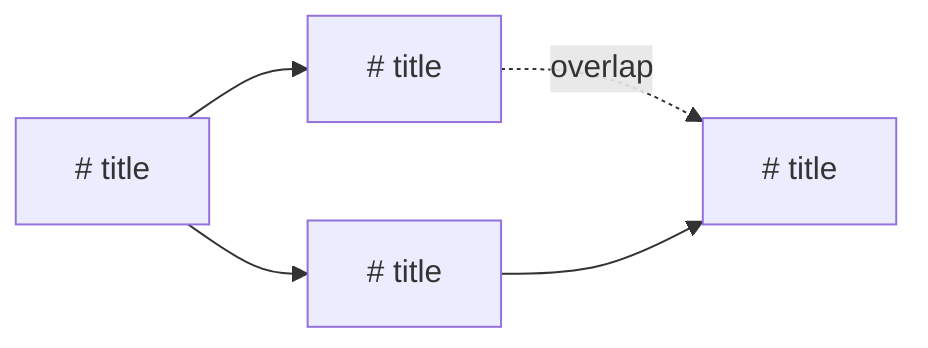

# /to-issues

Decompose planning artifacts into tracker tasks. Each task is an independently demoable story. Stories hang off a single parent feature, and stories that genuinely block one another are joined by a **blocked-by edge** written through `add-blocker.sh`. Creates items in your active tracker backend (GitHub issues, ADO work items, Todoist tasks, or local task files).

**Why the links matter.** Anything that schedules work off this board — an external agent scheduler, or `/plan` picking what's next — reads those links to decide what it can start now and what has to wait. A decomposition with no links looks fully parallel, so a scheduler will launch everything at once, including work that is not yet buildable. The dependency graph is therefore a first-class output of this skill, not a note in a description.

**Designed for solo developers on personal GitHub plans.** No org features required — uses issues, sub-issues, labels, milestones, and optionally projects.

Reads from ALL available planning artifacts in the decide/define phases. No single artifact is required — uses whatever exists.

**Triggers:** explicitly called with `/to-issues`

## Input

```
/to-issues [--parent "<id>"] [--milestone "<name>"] [--project "<name>"] [--with-tasks]
```

- `--parent "<id>"` — attach the stories to an existing parent feature instead of creating one. Without it, the skill creates the parent itself (see Phase 6a).
- `--milestone "<name>"` — group all stories under this milestone (creates it if it doesn't exist). If not provided, infers a name from the grill-summary or architecture title. GitHub only.
- `--project "<name>"` — add all issues to a Projects v2 board (optional, for devs who want kanban/roadmap views). GitHub only.
- `--with-tasks` — also create child items for each story's breakdown. **Refused when the board feeds an agent scheduler** — see below. Default off: the breakdown lives in the story body.

### Why `--with-tasks` is refused on scheduler-backed boards

An agent scheduler picks up whatever is on its board, and typically applies **no work-item-type filter** — a Task is as schedulable as a story, and adopting a parent pulls its whole child subtree. Child tasks created here would silently become things the scheduler tries to launch an agent session for.

A project declares this in `tasks/tracker-config.md`:

```
feeds_agent_scheduler = true
```

When that is `true`, stop at feature → story. The breakdown still travels — it goes into the story body's `## Breakdown` section (see 6b), and `/story` or `/implement` produces the real task plan per story at build time. If `--with-tasks` is passed anyway, print:

> *"`--with-tasks` is not supported when `feeds_agent_scheduler = true`: child items land on the agent scheduler's board as launchable work. The task breakdown will be written into each story body instead. Continuing without it."*

...and continue without it. When the setting is absent or `false`, the flag behaves normally.

## Hard input gate

Before doing anything else:

1. Check that `trackers/active/create-issue.sh` exists. If not, halt: *"Tracker adapter not found. Run the harness installer or add `create-issue.sh` to `.claude/trackers/active/`."*
2. Scan for at least ONE planning artifact (see Phase 1). If none exist, halt: *"No planning artifacts found. Run `/grill-me` to establish shared understanding first, then optionally `/research` and `/architect`."*

## Phase 0 — Detect active backend and probe capabilities

Read `.claude/.harness-manifest.json`:
- `tracker` field → the active tracker backend (`github`, `local`, `todoist`, `ado`).

If no manifest or no tracker configured, fall back to `tasks/tracker-config.md` `**Type:**` field or adapter script detection in `.claude/trackers/active/`.

Record the backend — subsequent phases branch on it. Item creation and linking (`create-issue.sh`, `create-sub-issue.sh`, `add-blocker.sh`) are portable across all four shipped backends; Phases 5a/5b/5c and 6d are GitHub-only and are gated below.

Then probe two **capabilities** by checking whether the script exists in `trackers/active/`, and record each as yes/no:

| Capability | Script | If absent |
|---|---|---|
| Hierarchy — can a story be linked to a parent? | `create-sub-issue.sh` | Create stories flat via `create-issue.sh` and note it in the summary. |
| Dependency — can a blocked-by edge be written? | `add-blocker.sh` | Fall back to prose edges (Phase 6c). |

**All four shipped adapters implement both**, so both probes normally pass. Probe anyway rather than inferring from the backend name — a hand-rolled or trimmed adapter may be missing one, and a custom backend gains support the moment someone drops the script in, with no edit to this skill.

**What an edge actually is depends on the backend.** All four are readable back through `get-blockers.sh`, but only ADO writes a link the tracker itself understands:

| Backend | `add-blocker.sh` writes | Visible to a scheduler reading the board natively? |
|---|---|---|
| `ado` | native predecessor/successor link | yes |
| `github` | `Blocked by: #N` line in the issue body | no — only via `get-blockers.sh` |
| `todoist` | `Blocked by: #N` line in the task description | no — only via `get-blockers.sh` |
| `local` | `blocked_by:` frontmatter list | no — only via `get-blockers.sh` |

Carry this into the Phase 4 and Phase 7 reports so nobody mistakes a convention line for a native tracker link.

If `tracker === 'todoist'`, add a deprecation pointer: *"This project's tracker is Todoist — prefer `/to-todoist`, which creates the Todoist milestone/subtask hierarchy. Continue only for flat issue creation."*

## Phase 1 — Read all available artifacts

Read every artifact that exists. Each adds context for decomposition:

| Priority | File | What it provides |
|----------|------|-----------------|
| 1 | `grill-summary.md` | Core concept, scope boundaries, resolved decisions |
| 2 | `ARCHITECTURE.md` or `docs/ARCHITECTURE.md` | System design, components, data model |
| 3 | `research.md` | External tech constraints, API shapes, gotchas |
| 4 | `decision-brief.md` | Risk-ranked assumptions, dealbreaker flags |
| 5 | `PRD.md` | Detailed user stories (if using Ralph workflow) |

Also check `tasks/stories/<id>/` variants of each file.

**At least one must exist.** The more artifacts available, the better the decomposition. Typical paths:

- **Minimal (just grill-me):** shared understanding → stories are higher-level
- **Full (grill + research + architect):** rich context → stories are precise and well-scoped
- **Ralph path (PRD):** user stories already defined → convert to proper tracker hierarchy

## Phase 2 — Synthesize requirements

From the artifacts, extract:

1. **Project name** — from the grill-summary title or PRD title
2. **Feature list** — what needs to be built (from resolved forks, user stories, or architecture components)
3. **Scope boundaries** — what's in and what's out
4. **Technical constraints** — from research gotchas, architecture decisions
5. **Risk flags** — from decision-brief assumptions, architecture security section
6. **Dependencies** — ordering constraints (schema before API before UI), and which components each piece of work touches. Note the touched files/modules per requirement as you read — Phase 3.5 needs them to spot overlap.

## Phase 3 — Decompose into vertical slices (stories)

**Slicing rules:**
- Each story is independently demoable — you could verify it works on its own
- Prefer many thin slices over few thick ones
- No horizontal-only slices — "add the schema column" alone is not a story; it belongs inside a story that delivers a visible behavior
- Each story includes schema + API + UI + tests end-to-end as applicable

Identify 3–12 stories. For each story, prepare:

| Field | Content |
|---|---|
| **Title** | Imperative verb phrase, ≤ 60 characters |
| **What it delivers** | 1–2 sentences describing the end-to-end behavior |
| **Source artifact** | Which artifact(s) this derives from (e.g., "grill-summary § Resolved fork #3", "ARCHITECTURE.md § Data architecture") |
| **Risk flags** | Any of: `security-sensitive`, `performance-sensitive`, `customer-data-touching`, `regulated-data` |
| **Acceptance criteria** | 3–5 statements in Given/When/Then format |
| **Breakdown** | 2–5 implementation steps. These become child items only when `--with-tasks` is honored; otherwise they go in the story body's `## Breakdown` section |
| **Labels** | priority label + any risk labels |
| **Touches** | the files/modules/components this story will modify — used by Phase 3.5, not written to the tracker |

**Story ordering:** schema/data first → backend/API → frontend/UI → integration/polish.

**Create the stories in the order you want them run.** On a board that sorts unranked items by id, creation order *is* run order — so the sequence you settle on here decides which of several ready stories a scheduler starts first. This skill deliberately does not set an explicit rank field.

Also decide the **parent feature**: a title and a one-paragraph description covering the whole initiative. Skip this if `--parent` was passed.

## Phase 3.5 — Build the dependency graph

Stories that block one another must be joined by a real edge. Derive the edges yourself from the artifacts; do not ask story-by-story.

**An edge means: this story cannot start until that one is done.** Write every edge as `blocked story ← blocker`, and tag each with one of two reasons:

| Reason | When | Example |
|---|---|---|
| `prerequisite` | The blocked story genuinely cannot be built or demoed until the blocker exists. | The API story needs the schema story's table. |
| `overlap` | The two are conceptually independent but modify the **same file or module**, so running them in parallel means one silently clobbers the other on merge. | Two features that both rewrite the same service class. |

`overlap` edges are real and must be written — parallel agents work in separate worktrees, and nothing downstream can detect the clobber. But tag them distinctly, because they are the ones worth dropping when you know both changes are purely additive.

**Rules for the graph:**

- **Fewest edges that are actually true.** Every edge you add removes parallelism, which is the whole point of the exercise. Do not add an edge just because one story feels "later" than another — ordering is already carried by creation order.
- **No transitive edges.** If C is blocked by B and B by A, do not also write C ← A. It adds nothing and clutters the board.
- **Never use a "related" link as a blocker.** In ADO, `System.LinkTypes.Related` is informational; a scheduler reads only the predecessor link. A related link where a blocker was meant is an edge that silently does nothing. `add-blocker.sh` already writes the right relation on every backend — do not hand-roll one.
- **No cross-project / cross-repo edges.** A scheduler that resolves blockers by id within one project cannot see them, and an unresolvable blocker typically fails *closed* — stalling its dependent until a human force-starts it. If the graph needs one, leave it out and record it under "Open items" in the Phase 4 review instead.

### Cycle pre-flight — hard gate

Before Phase 4, walk the edge list and check for cycles (including self-edges). **If you find one, do not continue.** Print the exact chain and stop:

> *"Dependency cycle: story 3 → story 5 → story 7 → story 3. Nothing has been created. Break the cycle by removing an edge or merging two stories, and re-run."*

This check lives here because a downstream scheduler is likely to **fail open** on a cycle — detecting it, leaving every member schedulable, and only posting a notification — so a cycle written to a shared board silently discards the ordering rather than announcing itself. Catching it before the first write is the only cheap moment.

## Phase 3.6 — Resolve the destination

Items created in the wrong bucket are the quietest failure this skill has: they are created successfully, links and all, and never appear in the view the team or the scheduler actually reads. (A scheduler typically scopes its board by a query like `AreaPath UNDER <x> AND IterationPath = <the sprint the user picked>`.)

So: **discover the options, show them, and always ask. Never silently accept an adapter default.**

What "destination" means per backend:

| Backend | Destination | Discover with |
|---|---|---|
| `ado` | iteration path + area path | `az boards iteration project list`, `az boards area project list` |
| `github` | milestone (and project board, if `--project`) | `gh api repos/:owner/:repo/milestones`, `gh project list` |
| `todoist` | project + section | `td` project/section listing — prefer routing to `/to-todoist` |
| `local` | n/a — skip this phase | — |

1. **Try to list the real options** from the active tracker, read-only. Use a `trackers/active/` script if one exists for it; otherwise the backend's own CLI, per the table.
2. **If discovery fails, or returns nothing, or is ambiguous — ask outright.** Do not guess and do not fall back to the value hardcoded in the adapter script.
3. Ask once, as a single question, and carry the answer into the Phase 4 approval block so it is visible before anything is written:

> *"Where should these go? Iterations found: Sprint 1, Sprint 2, Sprint 3 (current). Areas found: Developer Playground\SDLC Harness, Developer Playground\Platform. Which iteration and area?"*

Default the offer to the `ado_area_path` / `ado_iteration_path` values in `tasks/tracker-config.md` if set, else to whatever the last `/to-issues` run used if that is recorded in `tasks/notes.md`.

## Phase 4 — Review with user

Present the proposed decomposition — stories, destination, edges, and both graph views. Nothing has been created yet.

> **Initiative:** [project name — one-line summary]
> **Parent feature:** [title — or "existing #N" if `--parent` was passed]
> **Destination:** [iteration] / [area] — from Phase 3.6
> **Dependency links:** [native predecessor links | `Blocked by:` body lines, readable via `get-blockers.sh` | prose only — this adapter has no link script]
>
> **Stories** — listed in creation order, which is also run order:
>
> | # | Title | Delivers | Risk | Blocked by |
> |---|-------|----------|------|------------|
> | 1 | ... | ... | ... | — |
> | 2 | ... | ... | ... | 1 |
> | 3 | ... | ... | ... | 1 |
> | 4 | ... | ... | ... | 2, 3 |
>
> **Edges** — each one removes parallelism, so each needs a reason:
>
> | Blocked | Blocker | Reason | Why |
> |---------|---------|--------|-----|
> | 2 | 1 | prerequisite | needs the table from #1 |
> | 3 | 1 | prerequisite | needs the table from #1 |
> | 4 | 2 | overlap | both rewrite `OrderService` |
>
> **Tree:**
>
> ```
> Feature: <parent title>
> ├── 1. <story title>
> ├── 2. <story title>          (blocked by 1)
> ├── 3. <story title>          (blocked by 1)
> └── 4. <story title>          (blocked by 2, 3)
> ```
>
> **Graph:**
>
> ```mermaid
> flowchart LR
>   S1["1. story title"] --> S2["2. story title"]
>   S1 --> S3["3. story title"]
>   S2 -.->|overlap| S4["4. story title"]
>   S3 --> S4
> ```
>
> **What runs in parallel:** stories 2 and 3 can start together once 1 is done. Story 4 waits for both.
>
> "Does this look right? You can merge, split, or reorder stories, and add or drop any edge — dropping an `overlap` edge is the usual one if you know both changes are additive. Say 'go' to create everything."

**Rendering rules for the two views:**
- The **tree** shows hierarchy only (feature → stories) with blockers annotated in parentheses. It must read correctly as plain text in a terminal.
- The **mermaid graph** shows the blocking edges, arrow pointing *from blocker to blocked* (reading direction = execution order). Draw `overlap` edges dotted and labelled so they are distinguishable from `prerequisite` edges. Use `flowchart LR`.
- If there are **no edges at all**, say so explicitly — "every story is independent; all N can run in parallel" — and skip the mermaid block rather than drawing a graph with no arrows.

Do not proceed to Phase 5 without explicit user approval. If the user changes any edge, re-run the Phase 3.5 cycle check before continuing.

## Phase 5 — Setup infrastructure

**GitHub-only.** `setup-labels.sh`, `create-milestone.sh`, `create-project.sh` (and `add-to-project.sh` in Phase 6) exist ONLY under `trackers/github/`. Run this phase only when `backend === 'github'` (equivalently: only run each call if the script exists in `trackers/active/`). For `local`/`todoist`/`ado`, skip label/milestone/project setup and print: *"Backend <X> has no label/milestone/project infrastructure in the standard adapter interface — skipping Phase 5; work items are created directly."*

Before creating issues, set up the supporting GitHub infrastructure:

### 5a — Labels

Check if harness labels exist (look for `priority:high` label). If not:
```bash
bash trackers/active/setup-labels.sh
```

### 5b — Milestone

Infer or use the provided milestone name. Create if it doesn't exist:
```bash
bash trackers/active/create-milestone.sh "<milestone-name>" "<description from grill-summary overview>"
```
If the milestone already exists (API returns 422), that's fine — use the existing one.

### 5c — Project (only if --project provided)

```bash
bash trackers/active/create-project.sh "<project-name>"
```
Store the project number for adding items later. Note: requires `gh auth refresh -s project`.

## Phase 6 — Create issues

Order of operations is fixed: **parent first, then stories in the approved order, then the edges.** Edges last, because they need the real IDs of both ends.

On ADO, export the destination from Phase 3.6 before the first call so every item lands in the right bucket — the adapter scripts read it from the environment, and a child does **not** inherit its parent's area path:

```bash
export ADO_AREA_PATH="<area from Phase 3.6>"
export ADO_ITERATION_PATH="<iteration from Phase 3.6>"
```

### 6a — Create the parent feature

Skip if `--parent <id>` was passed; use that ID as the parent instead.

On ADO the work item type is set via the `ADO_WORK_ITEM_TYPE` env var — an env var rather than a positional arg because arg4 is the milestone slot in the GitHub adapter and the section slot in Todoist.

```bash
# ado
ADO_WORK_ITEM_TYPE="Feature" bash trackers/active/create-issue.sh "<feature title>" "<feature description>" "priority:medium"

# github / local / todoist
bash trackers/active/create-issue.sh "<feature title>" "<feature description>" "priority:medium"
```

Parse the printed ID and hold it as `PARENT_ID`. If the parent fails to create, **halt** — do not create orphan stories.

For an adapter with no hierarchy capability (Phase 0 probe), skip this step and create stories flat.

### 6b — Create story issues

Create the stories **in the approved order** — on a board that sorts unranked items by id, that order is the run order, and creating them out of sequence silently changes which one a scheduler starts first.

Where the hierarchy capability exists, create each story as a child of the parent. On ADO the adapter's child type defaults to `Task`, which is the wrong level for a story — set it explicitly to the story-level type for your process (`User Story` on Agile, `Product Backlog Item` on Scrum):

```bash
# ado
ADO_WORK_ITEM_TYPE="User Story" bash trackers/active/create-sub-issue.sh "$PARENT_ID" "<title>" "<body>" "priority:medium,<risk-labels>"

# github / local / todoist
bash trackers/active/create-sub-issue.sh "$PARENT_ID" "<title>" "<body>" "priority:medium,<risk-labels>"
```

Every adapter prints `{"parent": N, "child": N, "url": "..."}` — parse `.child` and record it against the story's number from the Phase 4 table. You need that map for 6c.

Without the hierarchy capability, call `create-issue.sh` in the form that matches the backend:

- **github** — keep the 5-arg form (arg4 = milestone, arg5 = project):
```bash
bash trackers/active/create-issue.sh "<title>" "<body>" "priority:medium,<risk-labels>" "<milestone-name>" "<project_num>"
```
- **local / ado** — 3-arg form only (arg4/arg5 are ignored, but do not rely on that):
```bash
bash trackers/active/create-issue.sh "<title>" "<body>" "priority:medium,<risk-labels>"
```
- **todoist** — 3-arg form, and NEVER pass the milestone name as arg4 (in the Todoist adapter arg4 is the SECTION slot and arg5 is PROJECT, so forwarding a milestone name silently mis-files the task). Prefer routing to `/to-todoist`.

Story body format:
```markdown
## What this delivers
<1–2 sentence description>

## Source
- Artifact: <§ reference to source artifact and section>

## Risk flags
<comma-separated flags, or "none">

## Acceptance criteria
- Given <context>, when <action>, then <outcome>
- Given ...
- Given ...

## Breakdown
<the 2–5 implementation steps — included here instead of as child items whenever --with-tasks
was not honored; omit this section if --with-tasks ran and real child items were created>

## Blocked by
<"nothing" — or the blocker list; see 6c. Where the adapter writes a native link this section is a
human-readable mirror of the real link, so keep both in step.>

## Technical notes
<any relevant constraints from research.md or ARCHITECTURE.md>
```

Report where each task landed by parsing the adapter's stdout, per backend:
- **github / todoist / ado** — the adapter prints a URL; print the number/id + URL.
- **local** — `create-issue.sh` prints `<id> <path>` (e.g. `7 tasks/issues/7.md`); print `task #<id> -> tasks/issues/<id>.md`.

If creation fails, print the error and continue — but record which story numbers are missing, because their edges cannot be written in 6c.

### 6c — Write the dependency edges

Now that every story has a real ID, translate the approved edge list.

**Where `add-blocker.sh` exists** (Phase 0 probe — all four shipped adapters), one call per edge:

```bash
bash trackers/active/add-blocker.sh <BLOCKED_ID> <BLOCKER_ID>
```

Argument order is load-bearing and easy to get backwards: the **first** ID is the story that is blocked, the **second** is what it is waiting on. On ADO this writes the predecessor link on the blocked item, which is the direction a scheduler reads; reversed, it produces a valid link that means the opposite thing. Sanity-check against the Phase 4 "Blocked / Blocker" columns before running any of them.

The call is idempotent — re-running an existing edge exits 0 and reports "already blocked by". Verify the written graph with `get-blockers.sh <ID>` (returns a JSON array of blocker ids) on any story you want to double-check.

Skip any edge whose either end failed to create, and report it as unwritten rather than silently dropping it.

**Where it does not exist**, do not discard the graph — write it as prose. Update each blocked story's body so its `## Blocked by` section names its blockers by their real IDs, and label it clearly in the Phase 7 summary as notes rather than machine-readable links. If a link script is added for that backend later, this skill starts writing real edges with no further change.

### 6d — Create child items for the breakdown (only if --with-tasks)

Only runs when `--with-tasks` was passed **and** `feeds_agent_scheduler` is not `true` (see the Input section). Otherwise the breakdown went into each story's `## Breakdown` section and this phase is skipped.

For each story's breakdown steps:

```bash
# ado — the child of a story is a Task, which is the adapter default
bash trackers/active/create-sub-issue.sh <STORY_ID> "<task title>" "<task body>" ""

# github / local / todoist
bash trackers/active/create-sub-issue.sh <STORY_ID> "<task title>" "<task body>" ""
```

Task body format:
```markdown
## Task
<one-line description of what to implement>

## Done when
- [ ] <specific verifiable criterion>
- [ ] Tests pass
```

If a project board was created (github only), add each task:
```bash
bash trackers/active/add-to-project.sh <PROJECT_NUM> "<TASK_URL>"
```
Do NOT call `add-to-project.sh` on any other backend — it exists only under `trackers/github/`.

## Phase 7 — Summary

Repeat both graph views here with the **real IDs** — the Phase 4 versions used placeholder numbers, and this is the receipt showing what actually landed.

~~~markdown
## Created

**Feature:** #<PARENT_ID> — <title>   (or "attached to existing #N")
**Destination:** <iteration> / <area>

**Stories:**
| # | Issue | Title | Labels | Blocked by |
|---|-------|-------|--------|------------|
| 1 | #N | ... | priority:medium | — |
| 2 | #N | ... | priority:medium, risk:security | #N |

**Tree:**
```
Feature #<PARENT_ID>: <title>
├── #<id> <story title>
├── #<id> <story title>          (blocked by #<id>)
└── #<id> <story title>          (blocked by #<id>, #<id>)
```

**Graph:**


**Dependency links:** <N> written as <edge kind> · <N> written as text notes only
**Parallelism:** #<id> and #<id> can run at the same time; #<id> waits on both.

**Next step:** Run `/implement #<first-story-id>` to start building the first story.
~~~

**Be explicit about what kind of edge was actually written** — this is the one line a reader must not have to guess at. Use the Phase 0 table:

- **ado** — *"8 native ADO predecessor links."* A scheduler reading the board sees these directly.
- **github / todoist** — *"8 `Blocked by:` lines written into the item bodies, readable via `get-blockers.sh`. A scheduler that reads the board natively rather than through the adapter will treat all stories as independent."*
- **local** — *"8 edges written to the `blocked_by` frontmatter list, readable via `get-blockers.sh`."*
- **No link script at all** — *"This adapter has no `add-blocker.sh`, so the N edges were written into the story bodies as prose `Blocked by` notes and nothing can read them back."* Never let a prose edge be mistaken for a real one.
- **Anything unwritten** — list every edge skipped because an end failed to create, so it can be added by hand.

Then match the rest of the summary to where items actually landed:
- **ado** — `#N` + the work item URL; next step `/implement #<n>`. Include the Feature and Destination rows; omit the GitHub milestone/project/label rows (Phase 5 was skipped).
- **github** — `Issue #N` + URL; next step `/implement #<n>`. Add the infrastructure rows that apply: milestone (N stories assigned), project, labels created/updated.
- **local** — `task #<id> (tasks/issues/<id>.md)`; next step `/implement #<id>`. Mark milestone/project/label rows "n/a for local backend".
- **todoist** — task URL/title; next step `/implement "<title>"`. Omit the GitHub infrastructure rows.

If `--with-tasks` was honored, note how many child items were created per story; if it was refused, say so and point at the `## Breakdown` sections.

## Constraints

- Additive only — creates issues and links, never modifies or deletes existing ones (except adding to milestone/project, and setting the parent/blocked-by links on items it created itself)
- Max 12 stories per run — if more are needed, suggest splitting into multiple features
- **Dependency order is a real graph, not story numbering.** Numbering (creation order) decides which of several *ready* stories runs first; the blocked-by links decide what is ready at all. Both are needed.
- **Never write a cycle.** The cycle check in Phase 3.5 is a hard gate — a downstream scheduler is likely to fail open and silently ignore the ordering instead of complaining.
- **Never use a "related"-style link as a blocker**, and never write cross-project edges.
- Works on personal GitHub plans — no org features required
- Child items for the breakdown are optional via `--with-tasks`, and refused when `feeds_agent_scheduler = true` — by default the breakdown lives in the story body
